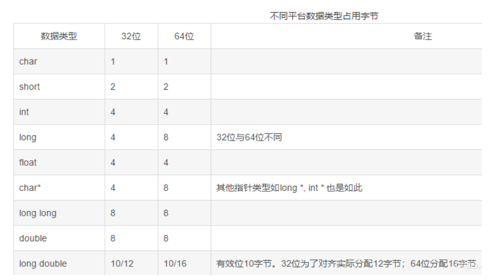
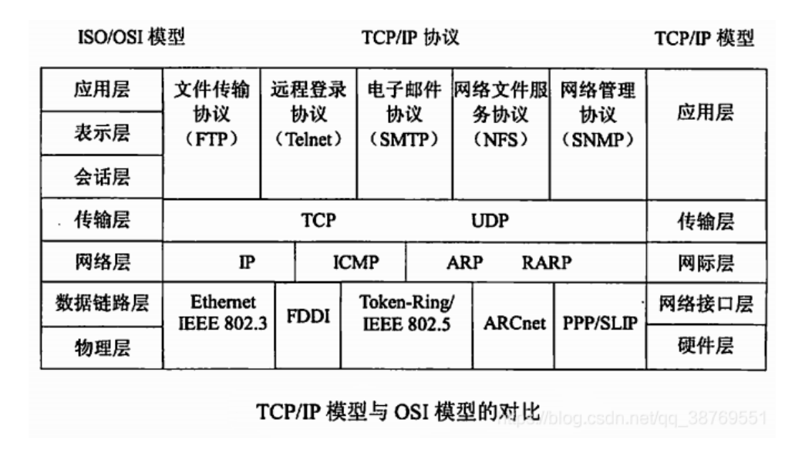
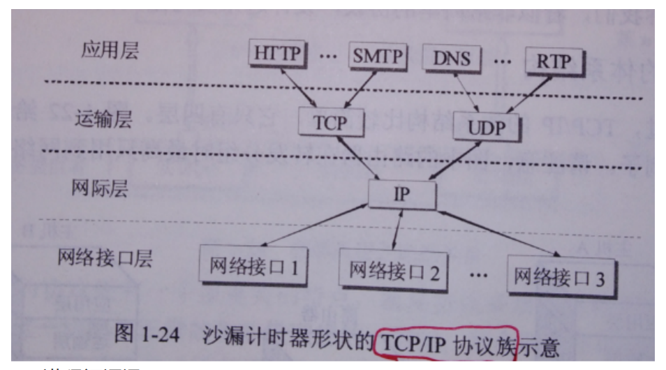

# 大厂面试题

## 万邦易嵌

1.  

```c
char str[10] = "love you";
 char *p = str;
int n = 10;
sizeof(str) = _10_____ ;
strlen(str) =  ___8___;

sizeof(p)=  ___4___ ;  
strlen(p) = _8_______; 
sizeof(n)= _4_______.

```

2. 

```C
int arr[]={6,7,8,9,10};
int *ptr = arr;
(*ptr++) += 123;//arr[0]先加上123 然后ptr++
//操作之后{129, 7, 8, 9, 10}
printf("%d,%d",*ptr,*(++ptr))；
```

输出结果分别是   7  ,    8   。

printf("%d,%d",*ptr,*(++ptr))，先执行括号里的++ptr，然后再打印

3. 

设int nui[]={1,2,3,4};,则nui[1] =  2      ;   nui[4] =  未知值    ;。

4. 

```c
若定义 unsigned char a, b, c;
则 a = 5; //0000 0101
 b = 15; //0000 1111
  c = 254;//1111 1110
c = b & a << 2 + ~c;
执行后 c 的值为____8_______。
```

15 & 5 << 2 + ~c

a <<2   ==> 5<<2  ==> 0000 0101  =>00010100 左移两位 补零 得20

~c  ==> ~1111 1110 ==> 0000 0001 得1

15 & 5<<2  ==>   0000 1111 & 0001 0100  ==> 00000100 得4

最终结果5

5. 

若有定义：char c= '\101 '; 则变量c中包含的字符个数为 __1____，是哪些字符___\101___。

6.	 如果unsigned char a =  ~( 0x01 <<  1)，a的结果是 253    。

0000 0001 << 1 ==0000 0010  

取反 1111 1101 =255 -2 =253

7.	

若变量已正确定义，语句if(a>b) k=0; else k=1;
请使用三目运算符号重新写这段代码
K=a>b?0:1;

8.	

在32位windows 平台下，分别写出以下几种类型所占的字节大小。

```c
char：  1  字节；
int:   2  字节；
long：    4字节;
float: 4     字节;
double:   8  字节;
```

9. 

如果char a,b,c,d;且a=123,那么b=a/100= 1  、c=a%100=  23  、d=a%100/10=  3 。

10.	

定义全局变量unsigned char a,b，计算表达式a+=b++之后，a=__0___，b=__1____

选择题

>如果定义unsigned char *sp，unsigned char a；假定sp指针指向30H地址单元（30H地址单元存放的数为6，那么进行a=*sp++,运算后a的值为（   B  ）
>A、30H；          B、6；            C、不确定。

2．若变量已正确定义并赋值，表达式（   B  ）不符合C语言语法。

A、a * b / c;     B、3.14 % 2       C、*&a        D、a / b / c

3．下面变量定义中哪些是合法的（   ACD   ）
A、char abd123 ;                B、char –abcd;

C、char _abc123 ;               D、char _123;

4．以下叙述中正确的是(  ABD  )。

A. 表达式a &＝ b等价于a ＝ a & b;     B. 表达式a |＝ b等价于a ＝ a | b;
C. 表达式a !＝ b等价于a ＝ a ! b;     D. 表达式a ^＝ b等价于a ＝ a ^ b;

5．在 C 程序中，用(  B )表示逻辑值”真”。

A. 1         B. 非 0 的数     C. 非 1 的数    D. 大于 0 的数

6．下列字符常量不正确的有(  A )

A. ‘\’     B. ‘\n’   C.‘100’   D.‘A’

7．能正确进行字符串赋值的是(  C    )

A、char s[5]= “abcde”;(包括空字符 为6)  B、char s[5];s= “good”;

C、char s[5]= “abcd”;   D、char s[5]; s[]=  “good”;

8．根据以下定义，错误的表达式是（ d    ）。

struct{int a;char b;} Q, *p = &Q;

A、 Q.a        B、(*p).b       C、 p->a       D、*p.b

9．有如下程序段：int *p, a = 10;   p = &a;   a = *p + 1;  p = p + 1;(假设a的地址为0x00FF34), 则执行该程序段后，a的值为______, p的值为 _____.(  C)

A、11    0x00FF35					B 、10    0x00FF34

C、 11    0x00FF38					D、 11	   12

指针+1，加4个字节

10 .能正确表示逻辑关系：“a≥10 或 a≤0”的C语言表达式是（  D  ）

A、a>=10 or a<=0
B、a>=0 | a<=10
C、a>=10 && a<=0
D、a>=10 || a<=0

解答题

简要说明C语言中const、static、extern、volatile的含义和应用场合；关键字const有什么含意？下面的声明都是什么意思？
>1）const int a;        固定整型值 a
>2）int const a;        固定整型值 a
>3）const int *a;       固定整型值 a
>4）int * const a;      固定整型指针 a
>5）int const * a const 。(可写在背面) 常指针常整型

2． 定义结构体：

```c
struct  STU
{
    unsigned char a1;
    int   b1;
    float c1;
    const  char  *sp1;
}name = {3,289,13.2,"zhangsan"},* xyd;
unsigned char a,b,c;
const char *d;
xyd = &name;
a =(*xyd).a1; 
b = xyd->b1; 
c = xyd->c1;
d = xyd->sp1;
printf("a:%d b:%d c:%d ;d:%s",a,b,c,d);
```

求执行完以上操作，a=3； b=289；  c=13.2;    d=zhangsan.

3，简要说明全局变量和局部变量的区别，最好举例说明。

在编程中，全局变量和局部变量是两种不同作用域的变量，它们的主要区别在于可见性和生命周期。

全局变量：

- **作用域**：在整个程序的任何地方都可以访问。
- **生命周期**：从程序开始执行到程序结束一直存在。
- **存储位置**：通常存储在静态存储区。
- **初始化**：如果没有显式初始化，则默认值为0（对于数值类型）或空字符串（对于字符串）。

局部变量：

- **作用域**：仅在其定义的函数或代码块内部可见。
- **生命周期**：仅在其定义的函数或代码块执行时存在，函数或代码块执行结束后销毁。
- **存储位置**：通常存储在栈中。
- **初始化**：如果没有显式初始化，则其值是未定义的。

示例代码：

```c
#include <stdio.h>
// 全局变量
int globalVar = 10;
void modifyLocalAndGlobal() {
    // 局部变量
    int localVar = 20;
    // 修改全局变量
    globalVar = 30;
    // 修改局部变量
    localVar = 40;
    printf("Inside function: globalVar = %d, localVar = %d\n", globalVar, localVar);
}
int main() {
    // 访问全局变量
    printf("In main before function call: globalVar = %d\n", globalVar);
    // 调用函数
    modifyLocalAndGlobal();
    // 再次访问全局变量
    printf("In main after function call: globalVar = %d\n");
    // 尝试访问局部变量（编译错误）
    // printf("In main: localVar = %d\n", localVar); // 错误
    return 0;
}
```

代码解释：
1. **全局变量** `globalVar` 在整个程序中都可以访问。
2. **局部变量** `localVar` 只在 `modifyLocalAndGlobal` 函数内部可见。
3. `modifyLocalAndGlobal` 函数修改了全局变量 `globalVar` 和局部变量 `localVar`。
4. `main` 函数中可以访问并修改全局变量 `globalVar`，但不能访问局部变量 `localVar`。

输出结果：

```
In main before function call: globalVar = 10
Inside function: globalVar = 30, localVar = 40
In main after function call: globalVar = 30
```

从输出结果可以看出：
- 全局变量 `globalVar` 在函数内外都可以访问，并且函数内的修改会影响到全局变量的值。
- 局部变量 `localVar` 只能在函数内部访问，函数执行结束后，局部变量被销毁，因此在 `main` 函数中无法访问 `localVar`。

这就是全局变量和局部变量的主要区别以及一个简单的例子。

编程题目

写出以下程序输出结果：

```c
struct stu
{
     int x;
     int *y;
}*p;
int dt[4] = {10, 20, 30, 40};
struct stu a[4] = { {50, &dt[0]}, {60, &dt[1]},{70, &dt[2]}, {80, &dt[3] }};
int main()
{
     p = a;
     printf(“%d,”, ++p -> x);
     printf(“%d,”,( ++p) -> x);
     printf(“%d,”, ++( *p -> y));
}
```

输出结果是: 51 60  21 

写出以下程序输出结果：

```c
int main()
{
   int a=2,j;
   for(j=0;j<3;j++)
       printf("%4d",fun(a));
}

fun(int a)
{
   int b=0,static int c=3;
   b++;c++;
   return (a+b+c);
   
} 
```

0:a=2,b=1,c=4 =>7
1:a=2,b=1,c=5 => 8
2:a=2,b=1,c=6 =>9

输出结果是:  7, 8,9

用C语言对数组a[7]={30,55,65,78,45,3,12}进行升序排列。

```c
//冒泡算法

void bubbleSort(int arr[] ,int n)
{
    int i,j,temp;
    for(i=0;i<n-1;i++)
    {
        for (j=0;j<n-i-1;j++)
        {
            if(arr[j]>arr[j+1])
            {
                temp=arr[j];
                arr[j]=arr[j+1];
                arr[j+1]=temp;
            }
        }
    }
}

```

求1/1-1/2+1/3-1/4+.....+1/99-1/100的值

```c
#include <stdio.h>
int main() {
    double sum = 0.0; // 初始化和为0.0
    int sign = 1; // 初始符号为正
    for (int i = 1; i <= 100; i++) {
        sum += (double)sign / i; // 将当前项加入总和
        sign *= -1; // 改变符号
    }
    printf("The sum is: %.10f\n", sum); // 输出结果
    return 0;
}


```

重写C库函数：char *strcpy(char dest[], const char *src); 这信函数功能是把从src地址开始且含有‘\0’结束符的字符串复制到以dest开始的地址空间。

```c
char *my_strcpy(char *dest, const char *src) {
    size_t i;
    for (i =0;src[i]!='\0',i++)
    {
        dest[i]=src[i];
    }
    // 添加null终止符
    dest[i] = '\0';
    return dest;
}
```

写一函数int fun(char *p)判断一字符串是否为回文，是返回1，不是返回0，出错返回-1。回文定义：一个字符串从左到右读和从右到左读是相同的，那就是回文，如：“12321”，这个就是回文。

```c
int fun(char *p)
{
    if(p==NULL)
        return -1;
    int length =strlen(p);
    int start =0;
    int end =length-1;

    while (start <end )
    {
        if (p[start]!=p[end])
        {
            return 0;
        }
        start ++;
        end --;
    }
    return 1;
}

```

## 小马智行

1、可以作为中断使用的安全同步方式是：

A spinlock 自旋锁
B mutex 互斥量
C semaphore 信号量
D 全局变量

linux中改变文件属性的命令：chmod

linux中查找文件中匹配字符串的命令：grep

下列哪一种协议是靠设备地址的不同区分的：IIC

全局未初始化变量存在哪里：BSS段

```c
#include<stdio.h>
void change(int *,int);

int main(){
    int a=25,b=50;
    change(&a,b);
    printf("a:%d,b %d",a,b);
    return 0;
}

void change(int *x,int y){
    *x=100;//通过指针 x 修改了外部变量 a 的值，将其设置为 100。
    y=200;//修改局部变量 y 的值为 200，但这不会影响外部变量 b 的值
}
```

输出结果为：100,50

```c
#include<stdio.h>

struct ponyai{
    char a;
    int b;
    short c;
    void *d;
};

int main(){
    struct ponyai hw;
    printf("%d\n",sizeof(hw));
return 0;
}

```

64位linux下 24，内存对齐8*3=24 （void *）=8

32位linux下 16，8*2 ， （void *）=4



```c
#include<stdio.h>
int main(){
    unsigned char a=2,b=5;
    printf("%d",(int)a^b);
    return 0;
}
```

^异或操作符，有1得1

a=2:0000 0010

b=5:0000 0101

a^b=0000 0111 =7

OSI网络模型中，下列不属于应用层协议的是





2、进程间通讯：

管道、无名管道  信号量，消息队列，共享内存，信号，socket

注意：临界区则是一种概念，指的是访问公共资源的程序片段，并不是一种通信方
式。

线程通讯（锁）：

（1）信号量（2）读写锁（3）条件变量（4）互斥锁（5）自旋锁

linux内存碎片化的定义，可能的原因以及可以避免或者缓解的方式

<https://www.cnblogs.com/linhaostudy/p/10129217.html>

内部碎片与外部碎片

在页式虚拟存储系统中, 用户作业的地址空间被划分成若干大小相等的页面, 存
储空间也分成也页大小相等的物理块, 但一般情况下, 作业的大小不可能都是物
理块大小的整数倍, 因此作业的最后一页中仍有部分空间被浪费掉了. 由此可知,
页式虚拟存储系统中存在内碎片.

在段式虚拟存储系统中, 作业的地址空间由若干个逻辑分段组成, 每段分配一个
连续的内存区, 但各段之间不要求连续, 其内存的分配方式类似于动态分区分配.
由此可知, 段式虚拟存储系统中存在外碎片.

在内存管理中, “内零头”和”外零头”个指的是什么?

在固定式分区分配, 可变式分区分配, 页式虚拟存储系统, 段式虚拟存储系统中,
各会存在何种碎片? 为什么?

解答:

在存储管理中

内碎片是指分配给作业的存储空间中未被利用的部分

在固定式分区分配中, 为将一个用户作业装入内存, 内存分配程序从系统分区表
中找出一个能满足作业要求的空闲分区分配给作业, 由于一个作业的大小并不一
定与分区大小相等, 因此, 分区中有一部分存储空间浪费掉了. 由此可知, 固定式
分区分配中存在内碎片.

外碎片是指系统中无法利用的小存储块.

在可变式分区分配中, 为把一个作业装入内存, 应按照一定的分配算法从系统中
找出一个能满足作业需求的空闲分区分配给作业, 如果这个空闲分区的容量比作
业申请的空间容量要大, 则将该分区一分为二, 一部分分配给作业, 剩下的部分仍
然留作系统的空闲分区。由此可知，可变式分区分配中存在外碎片.

简言之

随着存储区的分配和释放过程的进行, 在各个被分配出去的分区之间会存在很多
的小空闲区, 暂时不能被利用, 这就是”外部碎片”.

在固定分区管理算法中, 分给程序的内存空间往往大于程序所需的空间, 这剩余
部分的空间不能被其他程序所用, 这就是”内部碎片”

用C写一个function，可以获取一个文件名的宏定义

输入 filename.h
输出 FILE_NAME_H

```c
#include <stdio.h>
#include <ctype.h>
#include <string.h>
#include <stdbool.h>

// 将字符串转换为大写
void to_upper(char *str) {
    for (size_t i = 0; i < strlen(str); i++) {
        str[i] = toupper(str[i]);
    }
}

// 将字符串转换为宏定义格式
char *filename_to_macro(char *filename) {
    // 分配足够大的空间
    size_t len = strlen(filename);
    char *macro = malloc(len + 4); // 额外的空间用于下划线和 _H
    if (macro == NULL) {
        fprintf(stderr, "Memory allocation failed.\n");
        return NULL;
    }

    bool new_word = true;
    size_t pos = 0;

    for (size_t i = 0; i < len; i++) {
        char ch = filename[i];
        if (isalnum(ch)) { // 如果是字母或数字
            if (new_word) {
                macro[pos++] = '_'; // 添加下划线
                new_word = false;
            }
            macro[pos++] = toupper(ch); // 转换为大写并添加
        } else {
            new_word = true; // 遇到非字母数字字符，准备下一个单词
        }
    }
    // 添加 _H
    macro[pos++] = '_';
    macro[pos++] = 'H';
    macro[pos] = '\0'; // 添加 null 终止符
    return macro;
}

int main() {
    char filename[] = "filename.h";
    char *macro = filename_to_macro(filename);
    if (macro != NULL) {
        printf("Macro: %s\n", macro);
        free(macro); // 释放分配的内存
    }
    return 0;
}
```

比较字符串是否相等

使用 strcmp 函数

```c
#include <stdio.h>

bool stringsEqual(const char *str1, const char *str2) {
    while (*str1 && *str2) {
        if (*str1 != *str2) {
            return false;
        }
        str1++;
        str2++;
    }
    return *str1 == '\0' && *str2 == '\0';
}
```
