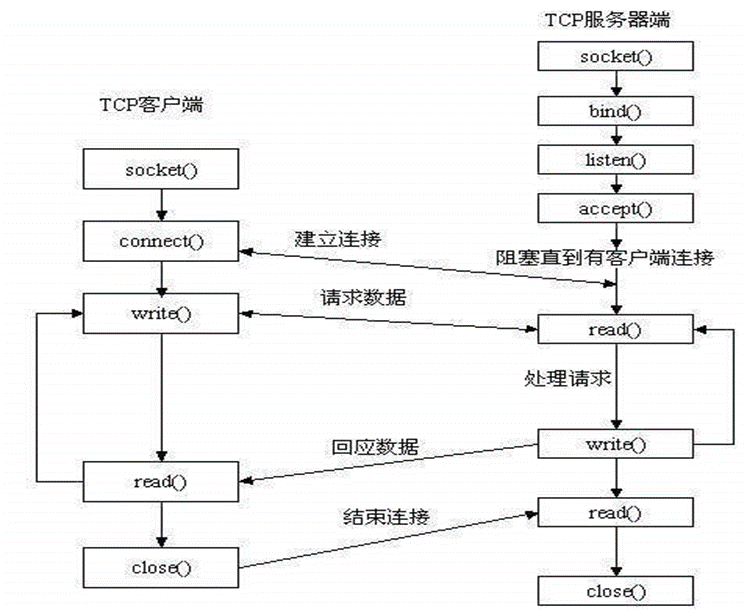
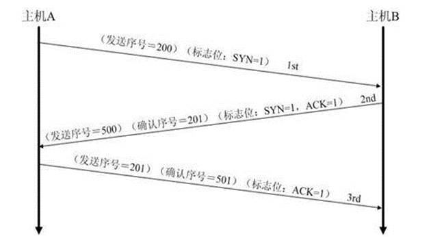
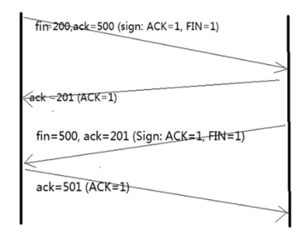

# 嵌入式软件开发工程师笔试面试题总结

关键字volatile有什么含义？给出三个不同的例子
>关键字volatile是防止变量被编译器优化。被volatile修饰的变量，编译器不会去假设该变量的值，当优化器每次用到该变量的值时，都会去变量的原始地址去读取这个变量的值，而不是使用保存在寄存器中的备份值。
>例子：（1）并行设备的硬件寄存器。
>（2）一个中断服务子程序中的非自动变量。
.（3）多线程应用中被几个线程任务共享的变量。

一个参数既可以是const还可以是volatile吗？解释为什么？

>答：可以。一个例子是只读的状态寄存器。它是volatile 因为它可能被意想不到地改变。它是const 因为程序不应该试图去修改它。

一个指针可以是volatile吗？解释为什么？

>答：可以。尽管这并不常见。一个例子是当一个中断服务子程序修改一个指向buffer的指针时。

关键字static的作用是什么？

>答：在C语言中：
>（1）修饰全局变量时，该全局变量只能 在本文件内使用。
>（2）修饰局部变量时，该变量生命周期延长到程序结束。如果该局部变量没有被初始化，其值默认为0，若已被初始化，则只能初始化一次。
>（3）修饰函数时，该函数只能在本文件中使用。
>在C++中：
>（1）被static修饰的成员变量在本质上是全局变量，所以需要在类的外部进行定义。
>（2）被static修饰的成员函数没有this指针，可以通过类名::函数名进行调用

static全局变量与普通的全局变量有什么区别？static局部变量和普通局部变量有什么区别？static函数与普通函数有什么区别？

>static全局变量与普通的全局变量有什么区别：static修饰的全局变量只初使化一次，且不能在其他文件单元中被引用;
>static局部变量和普通局部变量有什么区别：static修饰的局部变量生命周期从程序开始到程序结束，且只被初始化一次，下一次依据上一次结果值；
>static函数与普通函数有什么区别：static函数在内存中只有一份，普通函数在每个被调用中维持一份拷贝。

关键字const有什么含意？
>（1）可以定义const常量
>（2）const可以修饰函数的参数、返回值，甚至函数的定义体。被const修饰的东西都受到强制保护，可以预防意外的变动，能提高程序的健壮性。

定义一个返回值是指向函数的指针，且有一个指向函数的指针做参数的函数。

>typedef  int(*P)();
>P fun( int (*p)() );  

找出下面一段ISR的问题。

```c
_interrupt double cpmpute_area(double radius)
{
Double area = PI * radius * radius;
Printf(“\nArea = %f”,area);
Return area;
}
```

>答：(1)ISR不能有参数。
>(2)ISR不能有返回值。
>(3)ISR应该短且有效率，在ISR中做浮点运算不明智。

评价下面的代码片断：

```c
unsigned int zero = 0; 
unsigned int compzero = 0xFFFF; 
/*1's complement of zero */ 
```

>对于一个int型不是16位的处理器为说，上面的代码是不正确的。应编写如下： 
>unsigned int compzero = ~0;

typedef与#define的区别。
>#define在预编译的时候做简单的字符替换处理。
>typedef是在编译的时候进行的处理，并不是做简单的字符替换，而是同定义一个变量一样声明一个数据类型，然后用它去定义这种数据类型的变量。

Union与struct的区别。（故而常用struct）
>1.在存储多个成员信息时，编译器会自动给struct每个成员分配存储空间，struct 可以存储多个成员信息，而Union每个成员会用同一个存储空间，只能存储最后一个成员的信息。
>2.都是由多个不同的数据类型成员组成，但在任何同一时刻，Union只存放了一个被先选中的成员，而结构体的所有成员都存在。
>3.对于Union的不同成员赋值，将会对其他成员重写，原来成员的值就不存在了，而对于struct 的不同成员赋值 是互不影响的。

引用和指针有什么区别？
>1、引用必须初始化，指针不必；
>2、引用处画化后不能改变，指针可以被改变；
>3、不存在指向空值的引用，但存在指向空值的指针；

请说出const与#define 相比，有何优点？（故而常用const）
>答：1、const定义的是只读变量，#define为宏替换
>2、const不会改变变量的存储位置，#define定义的宏存储在代码段
>3、const 常量有数据类型，而宏常量没有数据类型。
>4、编译器可以对前者进行类型安全检查。而对后者只进行字符替换，没有类型安全检查，并且在字符替换可能会产生意料不到的错误。

堆与栈的区别。
>Heap是堆，Stack是栈。
>  (1)栈的空间由操作系统自动分配和回收，而堆上的空间由程序员申请和释放。
>  (2)栈的空间大小较小，而堆的空间较大。
>  (3)栈的地址空间往低地址方向生长，而堆向高地址方向生长。
>  (4)栈的存取效率更高。程序在编译期间对变量和函数的内存分配都在栈上，
>   	 且程序运行过程中对函数调用中参数的内存分配也是在栈上。

Linux环境下段错误出现的原因及调试方法
>出现原因：(1)访问不存在的内存地址。
>          (2)访问系统保护的内存地址。
>          (3)访问只读的内存地址。
>          (4)栈溢出。
>段错误调试方法：(1)使用printf在关键处打印输出信息。
>(2)使用gcc与gdb，编译时使用gcc -g命令，然后使用gdb进行调试。
>(3)使用core和gdb进行调试
>(4)使用objdump进行调试。
>(5)使用catchsegv

OSI七层模型与TCP/IP四层模型？
>答：OSI七层模型：物理层、数据链路层、网络层、传输层、会话层、表示层、应用层。
>TCP/IP四层模型：网络接口层（物理层、数据链路层）、网际层、传输层、表示层                  
>（会话层、表示层、应用层）。

OSI七层的对应各网络协议？
>答：物理层：IEEE 802.3（以太网协议）、RJ45
>数据链路层：HDLC 、 VLAN 、 MAC （网桥，交换机）、ARP(属于TCP/IP协议族)(在TCP/IP四层中属于网络层)
>网络层： IP 、ICMP(互联网控制信息协议)、 (ARP 、 RARP) 工作内容在数据链路层
>传输层： TCP、UDP
>会话层： NFS(网络文件系统协议) 、 SQL、RPC(远程调用协议)
>表示层： JPEG、MPEG
>应用层： FTP (文本传输协议)、 DNS 、 Telnet(远程登录协议) 、 SMTP(简单邮件传输协议) 、 HTTP(超远文本传输协议) 、 NFS

网络四类地址的区间？
>网络地址分为网络位和主机位。
>A类地址：1.0.0.0 --- 127.255.255.255(127.0.0.1为回环地址)(ping通本地回环地址说明本机协议没问题)
>B类地址：128.0.0.0 --- 191.255.255.255
>C类地址：192.0.0.0 --- 223.255.255.255
>D类地址：224.0.0.0 --- 239.255.255.255(广播地址)

简述TCP/UDP服务器端创建流程与客户端创建流程。
>TCP服务器端创建流程：创建通信用文件描述符(socket)-->设置端口号和IP地址(为绑定做准备)-->绑定(bind)-->监听(listen)-->接受请求，建立连接(accept)-->发送与接收消息(send/recv)-->关闭文件(close)
>TCP客户端创建流程：创建通信用文件描述符(socket)-->设置端口号和IP地址-->发起连接请求(connect)-->接受与发送消息(send/recv)-->关闭文件(close)
>UDP服务器端创建流程：创建通信用文件描述符(socket)-->设置端口号和IP地址(为绑定做准备)-->绑定(bind)-->接受和发送消息(sendto && recvfrom)-->关闭文件(close)
>UDP客户端创建流程：创建通信用文件描述符(socket)-->设置端口号和IP地址-->接受与 发送消息(sendto && recvfrom)-->关闭文件



简述三次握手与四次挥手。
在TCP/IP协议中，TCP协议提供可靠的连接服务，采用三次握手建立一个连接。
三次握手的过程：

 

>第一次握手：建立连接时，客户端发送SYN(SYN = j)包到服务器，并进入SYN_SEND状态，等待服务器的确认；
>第二次握手：服务器收到SYN包，必须确认客户的SYN(ACK = j+1)，同时自己也发送一个SYN包(SYN=k),即SYN+ACK包，此时服务器进入SYN_RECV状态；
>第三次握手：客户端收到服务器的SYN+ACK包，向服务器发送确认包ACK(ACK=k+1),此包发送完毕，客户端和服务器进入ESTABLISHED状态，完成三次握手。 



四次挥手的过程(客户端或服务器均可主动发起挥手动作)：
>（1）客户端A发送一个FIN，用来关闭客户A到服务器B的数据传送。
>（2）服务器B收到这个FIN，它发回一个ACK，确认序号为收到的序号加1。
>(和SYN一样，一个FIN将占用一个序号)。
>（3）服务器B关闭与客户端A的连接，发送一个FIN给客户端A。
>（4）客户端A发回ACK报文确认，并将确认序号设置为收到序号加1.

TCP与UDP的区别？
>（1）TCP是面向连接的协议，UDP是面向无连接的协议。
>（2）TCP对系统资源要求较多，UDP对系统资源要求较少。
>（3）TCP是数据流模式，UDP是数据报模式。
>（4）TCP保证数据顺序及数据的正确性，UDP可能会丢包。

如果内存已经泄露，该如何检测?
>(1)匹配malloc和free在个数上是否匹配。(grep -r “malloc” *| wc -l;grep -r “free” * |wc -l)
>(2)使用Visual Leak Detector检测工具。

TCP与UDP报头各占几个字节？
>TCP报头由10个必须字段（源端口号16位、目标端口号16位、序列号32位、确认号32位、报文长度4位、保留位与控制位各6位、窗口位16位、校验和16位、紧急指针16位）和一个可选字段，至少20个字节构成。
>UDP由（源端口号、目标端口号、数据报长度、校验值）四部分组成，每个域各占两个字节，故UDP报头为8个字节。

定义宏时需要注意什么？

>(1) 在定义#define 命令时，注意<宏名>和<字符串>之间用空格分开，而不是用等号连接。 　
>(2) 使用#define定义的标识符不是变量，它只用作宏替换，因此不占有内存。
>(3) 习惯上用大写字母表示<宏名>。
>(4) 定义宏函数时不能有数据类型。

面向对象的三大特征
>面向对象的三大特征是封装性、继承性和多态性：
>   封装性：将客观事物抽象成类，每个类对自身的数据和方法实行（protection、private、protected、public）。
>   继承性：广义的继承有三种实现形式：实现继承（使用基类的属性和方法而无需额外编码的能力)、可视继承(子窗体使用父窗体的外观和实现代码)、接口继承(仅使用属性和方法,实现滞后到子类实现)。
>   多态性：是将父类对象设置成为和一个或更多它的子对象相等的技术。用子类对象给父类对象赋值之后，父类对象就可以根据当前赋值给它的子对象的特性以不同的方式运作。
>   说明：面向对象的三个特征是实现面向对象技术的关键，每一个特征的相关技术都非常的复杂，程序员应该多看、多练。

如何创建守护进程？  

>只要保证进程与控制终端完全脱离，此进程就会成为一个守护进程
>  1、创建子进程，父进程退出 ---- 形式上做到与终端无关
>  2、在子进程中创建新会话 --- 与终端完全脱离，使该子进程成为新会话组的组长
>  3、更改当前工作目录为"/"或“/tmp” ---- 增强可移植性，防止其工作目录被删掉
>  4、重设文件权限掩码  ---增强守护进程创建文件的灵活性
>  5、关闭文件描述符  --- 关闭父进程打开的文件描述符

嵌入式系统经常具有要求程序员去访问某特定的内存位置的特点。在某工程中，要求设置一绝对地址为0x67a9的整型变量的值为0xaa66。编译器是一个纯粹的ANSI C编译器。写代码去完成这一任务。

```C
  答：int *ptr;
      ptr = (int *)(0x67a9);
      *ptr = 0xaa66;
```

请问以下代码有什么问题：

```c
int  main() 
{ 
char a; 
char *str=&a; 
strcpy(str,"hello"); 
printf(str);
return 0; 
} 
```

>答案：没有为str分配内存空间，将会发生异常问题出在将一个字符串复制进一个字符变量指针所指地址。虽然可以正确输出结果，但因为越界进行内在读写而导致程序崩溃。

char* s="AAA"; printf("%s",s); s[0]='B'; printf("%s",s); 有什么错？
>答案："AAA"是字符串常量。s是指针，指向这个字符串常量，所以声明s的时候就有问题。 cosnt char* s="AAA"; 然后又因为是常量，所以对是s[0]的赋值操作是不合法的。

进程与线程的区别
>线程与进程的区别:
>(1)调度:线程作为调度和分配的基本单位，进程作为资源拥有的资本单位。
>(2)并发性:不仅进程之间可以并发执行，同一进程的多个线程之间也可以并发的执行。
>(3)拥有资源：进程是拥有资源的独立单位，线程不拥有系统资源，但可以访问隶属于进程的资源.
>(4)系统开销：在创建或撤消进程时，由于系统都要为之分配和回收资源，导致系统的开销明显大于创建或撤消线程时的开销

参数传递有几种方式；
> 解析：传值，传指针或者引用

操作系统中进程调度策略有哪几种？
>　 解析：这个是操作系统的知识,FCFS(先来先服务)，优先级，时间片轮转，多级反馈

发生死锁的必然条件
>互斥条件、请求与保持、不可剥夺、循环等待。

C++语言中使用“extern C”有什么作用。
>  告诉编译器这段代码是用C语言编写的，因为C语言不支持函数重载，而C++支持函数重载，编译后的函数名不同。目的是实现C语言与C++语言的混合编程。

new delete与malloc free的区别。
>(1) malloc free是库函数，需要加载头文件，new delete是运算符，不需要加载头文件。
>(2)释放数组内存的时候，free(数组首地址)，delete[]数组首地址。
>(3)new申请内存的时候已经确定了数据类型，会有类型检查；malloc申请内存的时候并没有数据类型的检查，需要强制类型的转化。
>(4)malloc申请内存的入参是申请内存的字节数，new只需要指明数据类型和元素个数。
>(5)new一个对象的时候会自动调用该对象的构造函数，delete一个指针的时候，会自动调用该对象的析构函数.而malloc  free没有这个功能。

想让程序跳转到绝对地址0x100000处执行，该如何做？

>(*(void(*)(void) )0x100000)();
>( ( void(*)(void) ) 0x100000)();

内存泄露和内存溢出的区别

>内存溢出就是要求分配的内存大小超出了定义时所预设的内存大小，系统不能满足需求，于是产生溢出。
>内存泄漏是指向系统申请分配内存进行使用(new)，可是使用完了以后却不归还(delete)，结果你申请到的那块内存你自己也不能再访问（也许你把它的地址给弄丢了），而系统也不能再次将它分配给需要的程序。
