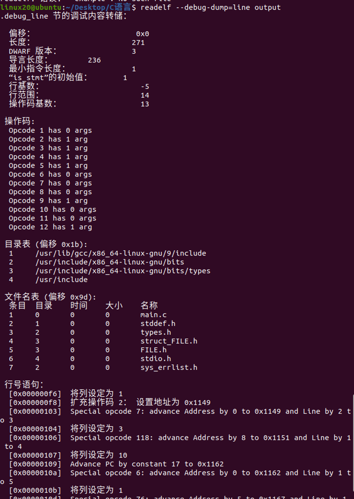
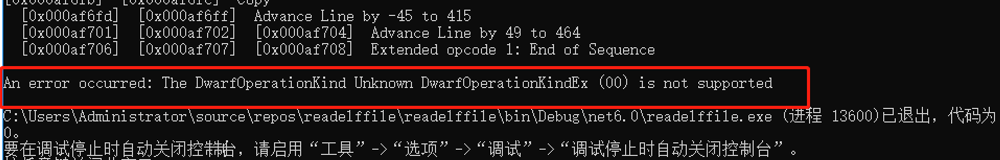

# DWARF
在ELF (Executable and Linkable Format) 文件中，符号表存储了程序的函数和变量的信息，但它并不直接存储这些符号所在的源文件名。源文件的信息通常在调试信息中，这需要程序在编译时带有调试信息（例如，使用gcc的-g选项）。然而，解析这些调试信息通常比较复杂，涉及到DWARF等专门的调试信息格式。

此代码加载ELF文件，然后获取并遍历符号表（如果存在的话）。每个符号的名称、地址和大小都会被打印出来。但是，如我所说，这并不会告诉你符号所在的源文件，要获取到这个信息，你可能需要解析DWARF调试信息，这大大超出了这个答案的范围，且在C#中可能会很复杂。

## 如何解析DWARF调试信息，从而获得符号所在源文件

DWARF (Debugging With Attributed Record Formats) 是一种调试信息格式，通常用于源码级别调试。它包含足够的信息以供调试器完成特定的一些功能，例如显示当前栈帧下的局部变量，尝试修改一些变量，直接跳到函数末尾等。DWARF 调试信息简单的来说就是在机器码和对应的源代码之间建立一座桥梁，大大提高了调试程序的能力。

DWARF 调试信息被放在一个叫作 `.debug_info` 的段中，该段与 DWARF 中其它的段类似，可以看成是一个表格状的结构，表中每一条记录叫作一个 DIE (debugging information entry), 一个 DIE 由一个 tag 及很多 attribute 组成，其中 tag 用于表示当前的 DIE 的类型，类型指明当前 DIE 用于描述什么东西，如函数，变量，类型等，而 attribute 则是一对对的 key/value 用于描述其它一些信息。

你可以使用 libdwarf 库来解析 DWARF 调试信息。libdwarf 库提供了一系列 API 来读取和解析 DWARF 调试信息。你可以使用这些 API 来获取符号所在源文件等信息。例如，你可以使用 `dwarf_diename` 函数来获取 DIE 的名称，使用 `dwarf_attr` 函数来获取 DIE 的属性值等。你可以参考 libdwarf 库的文档来了解更多关于如何使用这些 API 的信息。[2] [8] [9] [14]

源: 与必应的对话， 2023/8/8
(1) 调试信息（debugging information）——解析DWARF文件 - CSDN博客. <https://blog.csdn.net/Dong_HFUT/article/details/122617871>.
(2) DWARF, 调试信息存储格式 - 知乎 - 知乎专栏. <https://zhuanlan.zhihu.com/p/419908664>.
(3) DWARF 中的 Debug Info 格式 - twoon - 博客园. <https://www.cnblogs.com/catch/p/3884271.html>.
(4) 使用libelfin库通过dwarf信息读取行号 - 菜鸡的博客 | WTCL. [https://bbkgl.github.io/2020/02/08/使用libelfin库通过dwarf信息读取行号/](https://bbkgl.github.io/2020/02/08/%E4%BD%BF%E7%94%A8libelfin%E5%BA%93%E9%80%9A%E8%BF%87dwarf%E4%BF%A1%E6%81%AF%E8%AF%BB%E5%8F%96%E8%A1%8C%E5%8F%B7/).
(5) DWARF文件初探——提取轻量符号表 - 简书. <https://www.jianshu.com/p/cc06e38ce972>.
(6) 为什么 Debug Information Format 改为 DWARF 可以提高编译速度？ - 知乎. <https://zhuanlan.zhihu.com/p/112764192>.
(7) 求解答之VS2022调试时符号加载问题 - CSDN博客. <https://blog.csdn.net/ennuoi/article/details/125886519>.
(8) 使用libdwraf写的一个读取GCC -g参数编译生成的调试信息的例子_warriorpaw的博客-CSDN博客. <https://blog.csdn.net/warriorpaw/article/details/8660704>.
(9) 【软件调试】dwarf，readelf，strip_我要精通C++的博客-CSDN博客. <https://blog.csdn.net/Edidaughter/article/details/113653335>.
(10) undefined. [https://dwarfstd.org/doc/Debugging using DWARF-2012.pdf](https://dwarfstd.org/doc/Debugging%20using%20DWARF-2012.pdf).
(11) undefined. <https://dwarfstd.org/doc/DWARF4.pdf>.
(12) undefined. <https://eli.thegreenplace.net/2011/02/07/how-debuggers-work-part-3-debugging-information>.
(13) undefined. <https://www.jianshu.com/p/20dfe4fe1b3f>.
(14) undefined. <https://bing.com/search?q=>.
(15) undefined. https://www.cnblogs.com/Liu30/p/7903485.html.
(16) undefined. <https://www.cnblogs.com/sixbeauty/p/3998706.html>.

eadelf 命令提供了 -w 选项，可以用来显示 DWARF 调试信息

```bash
readelf  -w   outpot >dw.txt
```

查看dwarf所包含调试信息的四种方式:

1. readelf  GUN 提供的二进制工具，功能很多，并不限于读dwarf文件
2. gdb
3. drawfdump :是一个被打包再礼包dwarf内的程序
4. libdwarf : 是一个封装好的C库API 用来读取dwarf 的信息。

## DW_AT_decl_file

在 DWARF 中，DW_AT_decl_file 属性表示声明所在的源文件。它的值对应于包含调试信息条目的编译单元的行号信息表中的文件编号，表示声明出现的源文件

DW_AT_decl_file 属性的值为 4，这表示声明所在的源文件编号为 4。这个编号对应于包含调试信息条目的编译单元的行号信息表中的文件编号，表示声明出现的源文件。

## 查看编号多对应的源文件

```bash
readelf --debug-dump=line output 
```



查看.debug_info

```bash
readelf --debug-dump=info output
```

查看其中dwarf 版本 位4

## Dwarf版本4和5

DWARF 是一种用于描述程序的调试信息格式。它的版本 4 和版本 5 都是基于之前版本的标准，并且向上兼容。

DWARF 版本 5 相对于版本 4 做了更多改进，包括：

将 .debug_types 合并到 .debug_info 节中
支持将公共调试信息收集到单个补充对象文件中
替换行号程序头，以实现更好的数据压缩和源代码验证
支持分割对象文件和包表示，以便将 DWARF 信息与可执行文件分开存储
替换 .debug_macinfo 为 .debug_macro 表示，以更紧凑地表示 C/C++ 宏
替换 .debug_pubnames 和 .debug_pubtypes 为更实用的 .debug_names 节
替换位置列表（.debug_loc）和范围列表（.debug_ranges）节为新节（.debug_loclists 和 .debug_rnglists），以实现更紧凑的表示并消除重定位
添加新 TAG 来描述调用站点信息，包括尾调用和尾递归
改进对 FORTRAN 假定秩数组、动态秩数组和协数组的支持
添加新运算符，支持包含类型值的 DWARF 表达式栈
添加对 C++ 自动返回类型、删除成员函数和默认构造函数和析构函数的支持
添加新属性来标识不返回给调用者的子程序
添加 C 2011、C++ 2003、C++ 2011、C++ 2014、Dylan、Fortran 2003、Fortran 2008、Go、Haskell、Julia、Modula 3、Ocaml、OpenCL、Rust、Swift 和 BLISS 的语言代码。
许多小改进以提高功能性和性能2

错误

An error occurred: The DwarfOperationKind Unknown DwarfOperationKindEx (00) is not supported

位置

DwarfOperation.cs

throw new NotSupportedException($"The {nameof(DwarfOperationKind)} {kind} is not supported");

s搜索去停止打印

[0x000af667]  Set column to 5
[0x000af669]  Set is_stmt to 1
[0x000af66a]  Special opcode 35: advance Address by 2 to 0x96fb74[0] and Line by 2 to 438
[0x000af66b]  Set column to 76
[0x000af66d]  Set is_stmt to 0

`DW_OP_stack_value：标记一个常量。`



.debug_line

基本信息：偏移、长度、DWARF版本、最小指令长度、is_stmt初始值、行基数、行范围、操作码基数

操作码：

目录表：

行号语句：序列结束

dwarf的debug_info中有name但是没有DW_AT_decl_file时为什么？

在 DWARF 的 `debug_info` 节中，一个 `DIE`（Debugging Information Entry）可能包含 `DW_AT_name` 属性，但不包含 `DW_AT_decl_file` 属性。这种情况通常发生在某些类型的 `DIE` 中，例如编译单元（`DW_TAG_compile_unit`）或命名空间（`DW_TAG_namespace`）¹。

`DW_AT_name` 属性表示一个 `DIE` 的名称，而 `DW_AT_decl_file` 属性表示声明该 `DIE` 的源文件。并非所有类型的 `DIE` 都需要这两个属性。例如，编译单元通常包含一个 `DW_AT_name` 属性，表示编译单元所代表的源文件的名称，但它不需要包含一个 `DW_AT_decl_file` 属性，因为编译单元本身并不是在某个源文件中声明的。

希望这些信息能够帮助您理解为什么在 DWARF 的 `debug_info` 节中，一个 `DIE` 可能包含 `DW_AT_name` 属性，但不包含 `DW_AT_decl_file` 属性。如果您有其他问题，请告诉我。😊

源: 与必应的对话， 2023/8/15
(1) Map Var to Declaration Using Dwarf DebugInfo and Source Code. <https://stackoverflow.com/questions/48360758/map-var-to-declaration-using-dwarf-debuginfo-and-source-code>.
(2) debugging - DWARF debug information: Additional byte generated in .... <https://stackoverflow.com/questions/70862534/dwarf-debug-information-additional-byte-generated-in-element-inside-debug-info>.
(3) Exploring the DWARF debug format information - IBM Developer. <https://developer.ibm.com/articles/au-dwarf-debug-format/>.
