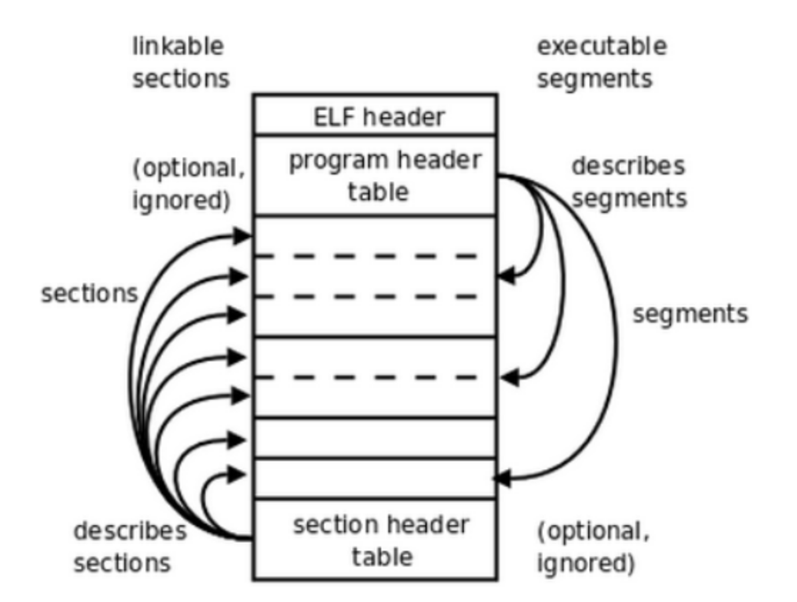
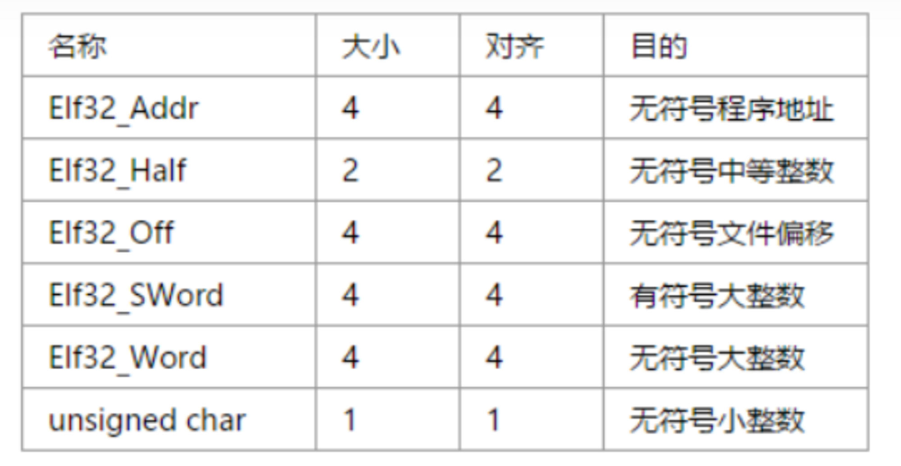
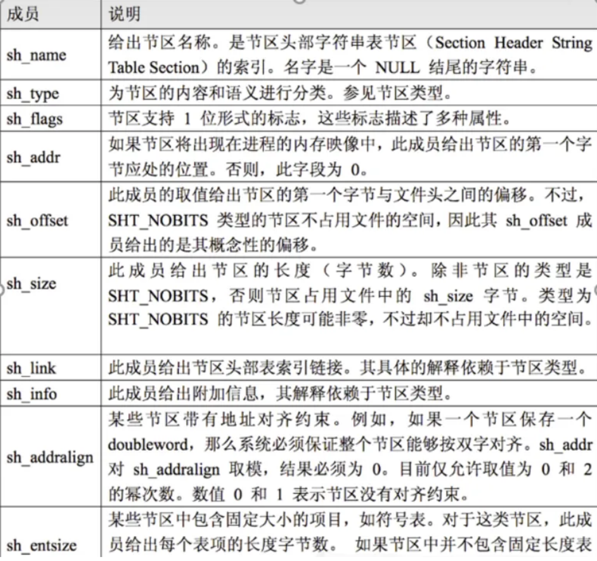
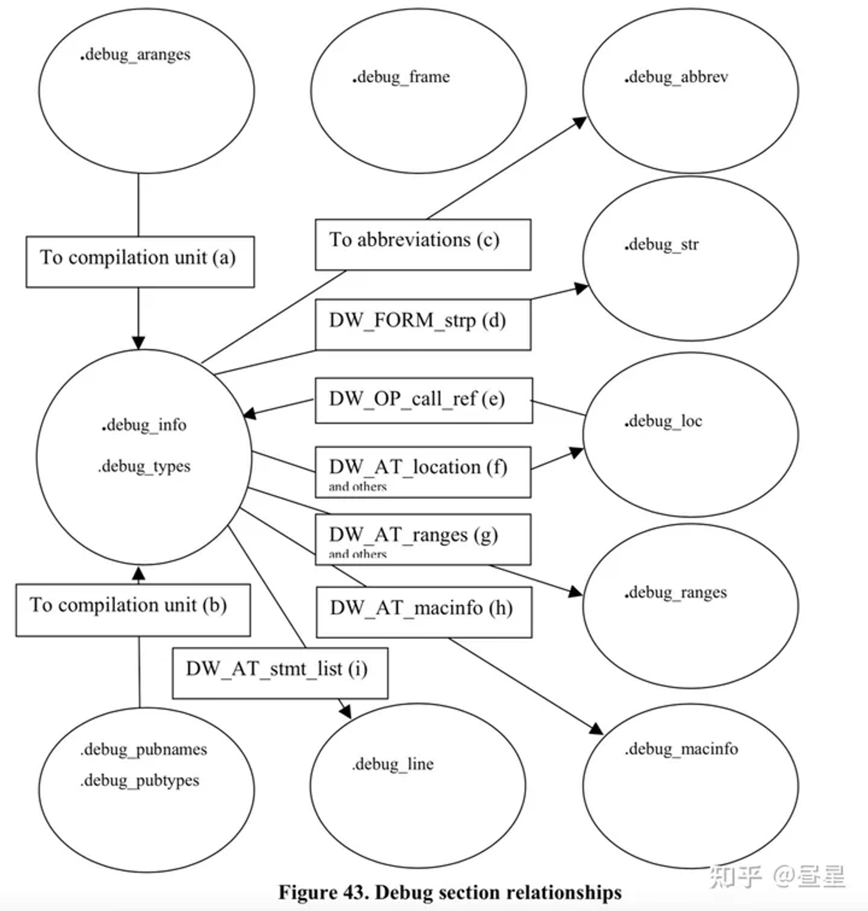
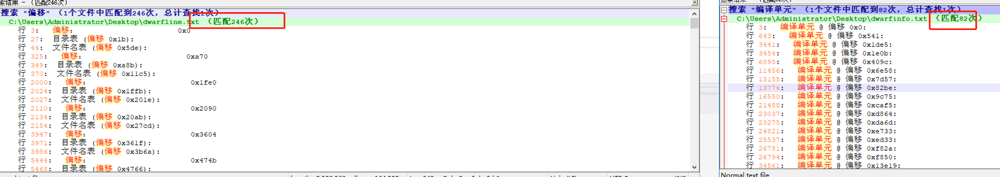

# 任务

解析ELF文件中的符号名，包括类型和所在的文件、行号、列号等信息。 开发语言使用C#

## ELF文件

GCC 编译器生成一个 64 位的 ELF 可执行文件
`gcc -m64 source.c -o output`

在 ELF 文件中，Dynamic section、Note section 和 ProgBits section 分别表示不同的内容。

Dynamic section（SHT_DYNAMIC）：包含动态链接相关信息1。
Note section（SHT_NOTE）：用于标记文件的信息1。
ProgBits section（SHT_PROGBITS）：包含程序需要的数据，格式和含义由程序解释2。

### 文件类型

1. 可重定向文件：文件保存着代码和适当的数据，用来和其他的目标文件一起来创建一个可执行文件或者是一个共享目标文件。
2. 可执行文件：文件保存着一个用来执行的程序。
3. 共享目标文件：即 .so 文件

### 文件的三个索引表

1. ELF header：在文件的开始，描述整个文件的组织。
2. Program header table：告诉系统如何创建进程映像。用来构造进程映像的目标文件必须具有程序头部表，可重定位文件不需要这个表。
3. Section header table ：包含了描述文件节区的信息，每个节区在表中都有一项，每一项给出诸如节区名称、节区大小这类信息。用于链接的目标文件必须包含节区头部表，其他目标文件可以有，也可以没有这个表。
4. sections 或者 segments：segments是从运行的角度来描述elf文件，sections是从链接的角度来描述elf文件。也就是说，在链接阶段，我们可以忽略program header table来处理此文件，在运行阶段可以忽略section header table来处理此程序。segments与sections是包含的关系，一个segment包含若干个section。


### elf hander结构体



### section

段表结构体


## ELF符号表

### 符号表表头

Linux 中使用指令查看完整读取elf文件

```bash
readelf -a example.elf
```

Num:    Value  Size Type    Bind   Vis      Ndx  Name

### 代表含义

Num   符号编号

Value  符号值，取决于上下文

Size    符号值

Type    符号类型，例如函数、对象、文件（源文件名称）、节（内存节）或未指定类型的绝对符号或未定义。

Bind   绑定属性，定义了符号的可见性和链接行为。例如，全局绑定意味着符号在所有文件中都可见，局部绑定仅在定义它的文件内可见，弱绑定类似于全局绑定，但符号可以被覆盖。  

Vis     符号可见性，可以是默认、受保护、隐藏或内部。

Ndx   符号定义所在的节头表索引。ABS表示绝对值：不调整任何节地址的重定位

Name  符号名称。

### 符号类型包括

STT_NOTYPE：未指定类型的符号。
STT_OBJECT：数据对象，例如变量或数组等。
STT_FUNC：函数或其他可执行代码。
STT_SECTION：与节相关的符号，通常是节的名称。
STT_FILE：源文件名称。

### 绑定属性

定义了符号的可见性和链接行为，包括：

STB_LOCAL：局部符号，仅在定义它的目标文件内可见。
STB_GLOBAL：全局符号，在所有目标文件中可见。
STB_WEAK：弱符号，在全局符号和局部符号之间。

### 符号可见性

定义了符号在目标文件外部的可见性，包括：

STV_DEFAULT：默认可见性，与全局和弱符号相关联。
STV_INTERNAL：仅供内部使用，不应在目标文件外部可见。
STV_HIDDEN：不可在目标文件外部引用，但可以通过动态链接器访问。
STV_PROTECTED：不可在共享库外部预先绑定，但可以通过动态链接器访问。

## section节和segment段

### （节）section

节是用于链接时的数据结构，它们包含了链接器链接目标文件所需的信息。节由节头（Section Header）描述，每个节头定义了一个节的属性，例如节在文件中的偏移量、节的大小和名称等。链接器会根据节头中的信息将目标文件中的数据合并到可执行文件中。

### （段）segment

段是用于运行时的数据结构，它们包含了程序运行所需的信息。段由程序头（Program Header）描述，每个程序头定义了一个段的属性，例如段在文件中的偏移量、段在内存中的虚拟地址、段的大小和权限等。当程序被加载到内存中运行时，操作系统会根据程序头中的信息将文件中的数据加载到内存中，并为每个段分配内存空间。

简而言之，段和节都是 ELF 文件中用于组织数据的数据结构，但它们用于不同的目的。段用于运行时，描述了程序如何被加载到内存中运行；而节用于链接时，描述了目标文件如何被链接成可执行文件。希望这些信息能够帮助您了解 ELF 文件中的段和节

### 对应ELF文件类型

段（Segment）和节（Section）都可以在不同类型的 ELF 文件中出现。

在**可重定位文件中**，节包含了用于链接的信息，例如代码、数据、符号表和重定位表等；

而在**可执行文件和共享目标文件**中，段包含了用于运行时的信息，例如代码、数据、动态链接信息和程序头等。

### ELF 可执行文件类型中既包含段（Segment）也包含节（Section）。

段是用于运行时的数据结构，它们包含了程序运行所需的信息。段由程序头（Program Header）描述，每个程序头定义了一个段的属性，例如段在文件中的偏移量、段在内存中的虚拟地址、段的大小和权限等。当程序被加载到内存中运行时，操作系统会根据程序头中的信息将文件中的数据加载到内存中，并为每个段分配内存空间。

节是用于链接时的数据结构，它们包含了链接器链接目标文件所需的信息。节由节头（Section Header）描述，每个节头定义了一个节的属性，例如节在文件中的偏移量、节的大小和名称等。链接器会根据节头中的信息将目标文件中的数据合并到可执行文件中。

在 ELF 可执行文件类型中，段包含了用于运行时的信息，例如代码、数据、动态链接信息和程序头等；而节包含了用于链接时的信息，例如代码、数据、符号表和重定位表等。

## 读取elf文件可以查看其中符号表中的符号所在的文件吗？

不，ELF 文件中的符号表（Symbol Table）仅包含符号的相关信息，例如符号名、值、大小、类型和绑定属性等，它并不包含每个符号所在文件的信息。符号表中的每个条目都对应一个符号，您可以通过解析符号表来获取 ELF 文件中的符号信息。

在ELF (Executable and Linkable Format) 文件中，符号表存储了程序的函数和变量的信息，但它并不直接存储这些符号所在的源文件名。源文件的信息通常在调试信息中，这需要程序在编译时带有调试信息（例如，使用gcc的-g选项）。然而，解析这些调试信息通常比较复杂，涉及到DWARF等专门的调试信息格式。

## DWARF

- [dWARF](/project_technical/ELF_C#/DWARF.md)

## LibObjectFile

DwarfLineProgramTable//打印程序表

.debug_line

基本信息：偏移、长度、DWARF版本、最小指令长度、is_stmt初始值、行基数、行范围、操作码基数

操作码：

目录表：

行号语句：序列结束

ELF节及它们的内容是

.debug_abbrev       用在.debug_info节的缩写

.debug_aranges      内存地址与编译单元之间的一个映射

.debug_frame        调用框信息

.debug_info           包含DIE的核心DWARF数据

.debug_line                        行号程序

.debug_loc                         宏描述

.debug_macinfo     全局对象及函数的一个查找表

.debug_pubnames 全局对象及函数的一个查找表

.debug_pubtypes   全局类型的一个查找表

.debug_ranges        DIE所援引的地址范围

.debug_str              由.debug_info使用的字符串表

使用C#有这么一种情况。我是使用libobjectfile读取的elf文件，读取dwarf的调试信息，当读取.debug_line的文件明表时，读取序号从1开始，和其中的文件名，不过其中有多个文件名表。同时之后读取.debug_info部分，里面包含DW_AT_name和DW_AT_decl_file.不过这里面的DW_AT_decl_file.是对应的序号。那么应该如何操作，能够获得符号和对应的源文件。

可以自己写一个读取：-但是没有对应关系

很离谱

完成程序能够读取大文件的程序，处理文件名表和符号名的对应

库文件逻辑

完成了一个line 一个info的对应关系，但是遇到了问题是：

dwarf版本的问题。这个项目文件中存在大量的dwarf2 版本。

但是libobjectfile中只适用于去读取版本4的编译单元。

## .debug_info

DWARF 提出 The Debugging Information Entry (DIE) 来以统一的形式描述这些信息

### DIE

### TAG

一个属性表描述什么类型的东西

TAG_subprogram：函数

TAG_formal_parameter：形式参数

TAG_variable: 变量

TAG_base_type： 基础类型

所有的 TAG 列表位于: 「DWARF4 Figure 1. Tag names」

### N个_Attribute(属性)

N 个属性(attribute), 用于具体描述一个DIE, 例如 DWARF info 示例 中对函数 foo 的描述:
0x0000002a: TAG_subprogram [2] *
AT_low_pc( 0x0000000100000f60 )起始PC地址
AT_high_pc( 0x00000018 )结束PC地址
AT_frame_base( rbp )函数的栈帧基址
AT_name( "foo" )函数的名字
AT_decl_file( "foo.c" )函数的源地址，实在这个文件中声明的
AT_decl_line( 1 )这个函数是在第几行声明 的
AT_prototyped( true )：bool值，为TURE时代表这是个子程序/函数
AT_type( {0x000000b2} ( int ) )描述返回值的类型是什么
AT_external( true )：bool值，这个函数是否为全局可访问

AT_stmt_list表示源代码行号程序（Line Number Program，LNP）的偏移量

### Section之间的关系



line 存储了行号相关信息, DW_AT_stmt_list 属性指向编译单元对应的 Line Table
里面有文件名，可以做一个表：将文件名加路径作为表头，然后在向里面加入信息文件名什么的

按照这个编译单元，82*3=246

所以一共有82个编译单元

按照每个编译单元去写一遍字典。

其中要注意的是：写多线程

字典：要没读取一次就要去清空一次字典《int string》型字典：

## 符号无对应源文件

这些符号并不来自于您编写的源文件，而是由编译器和链接器添加的。它们是用于初始化和终止程序，处理异常帧和全局偏移表等。这些符号通常来自于编译器和链接器使用的库文件和运行时支持文件

```SH
linux20@ubuntu:~/Downloads$ readelf  --debug-dump=line  example.elf  >dwarfline.txt
linux20@ubuntu:~/Downloads$ readelf  --debug-dump=info  example.elf  >dwarfinfo.txt
```
