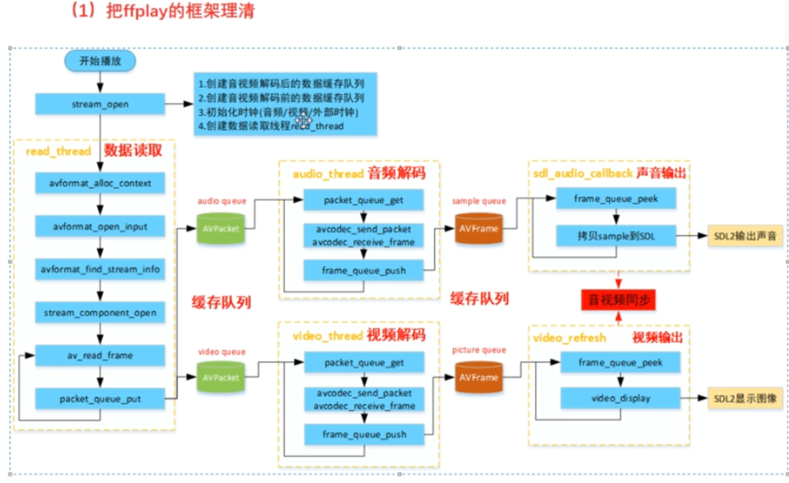
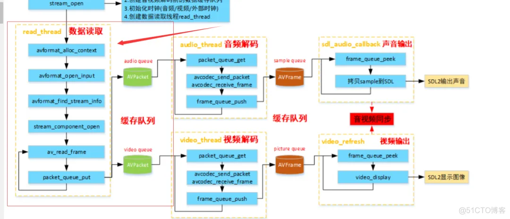
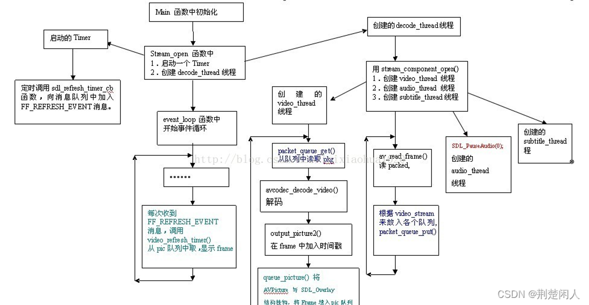
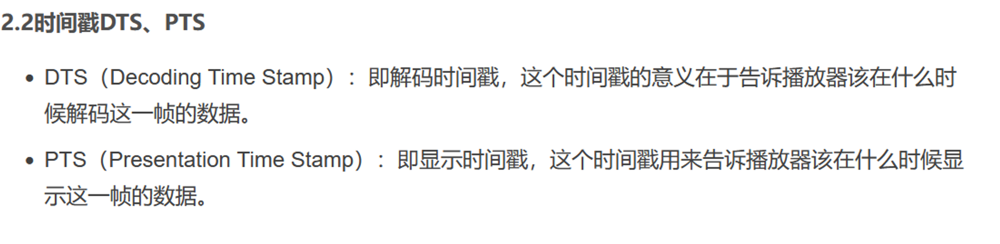
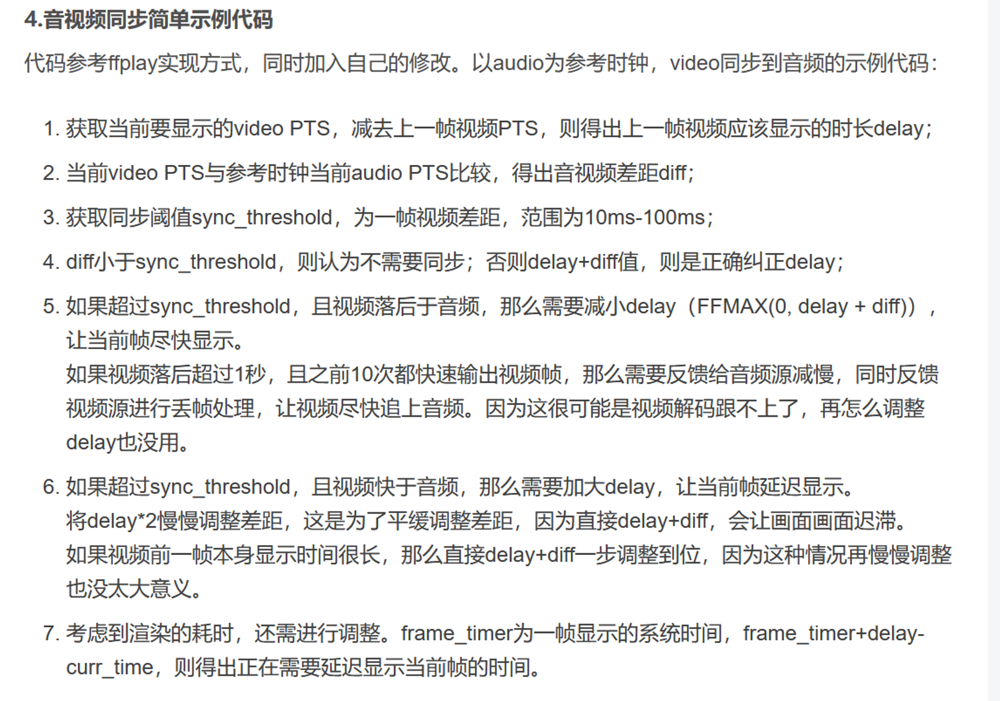
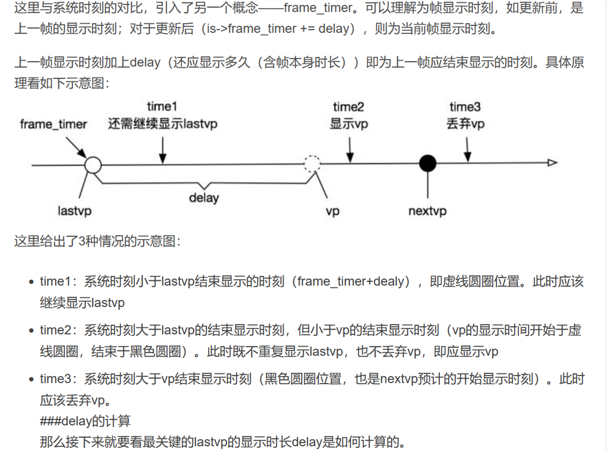
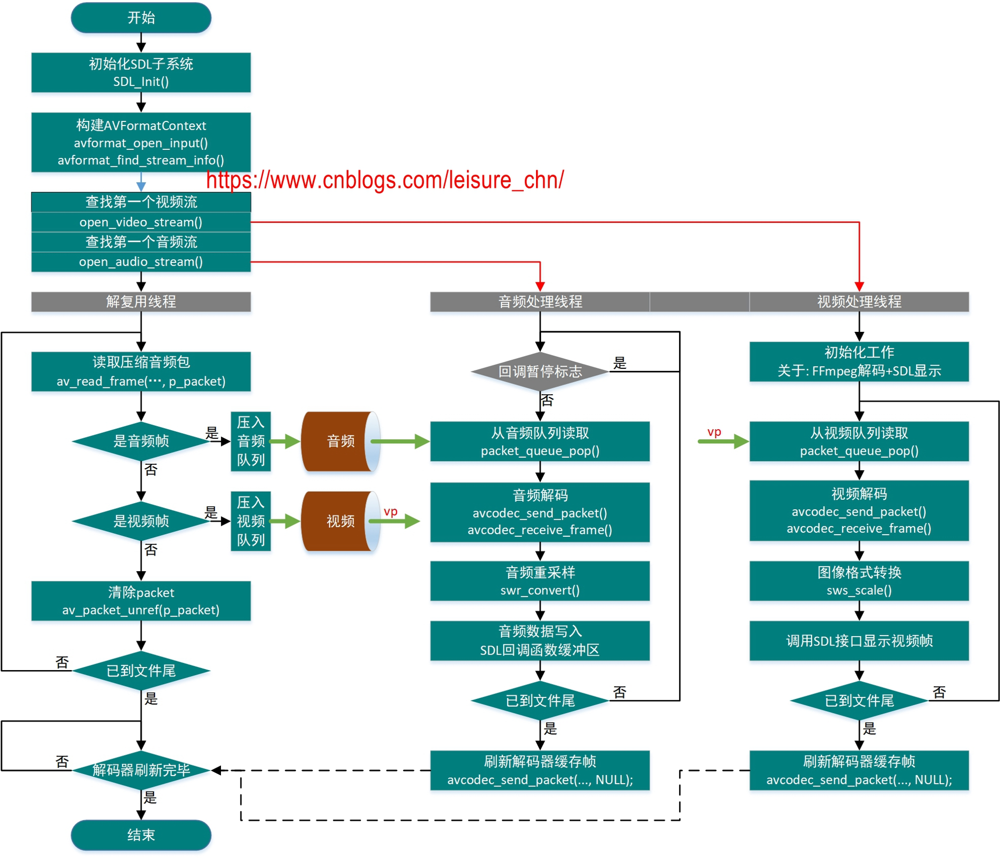
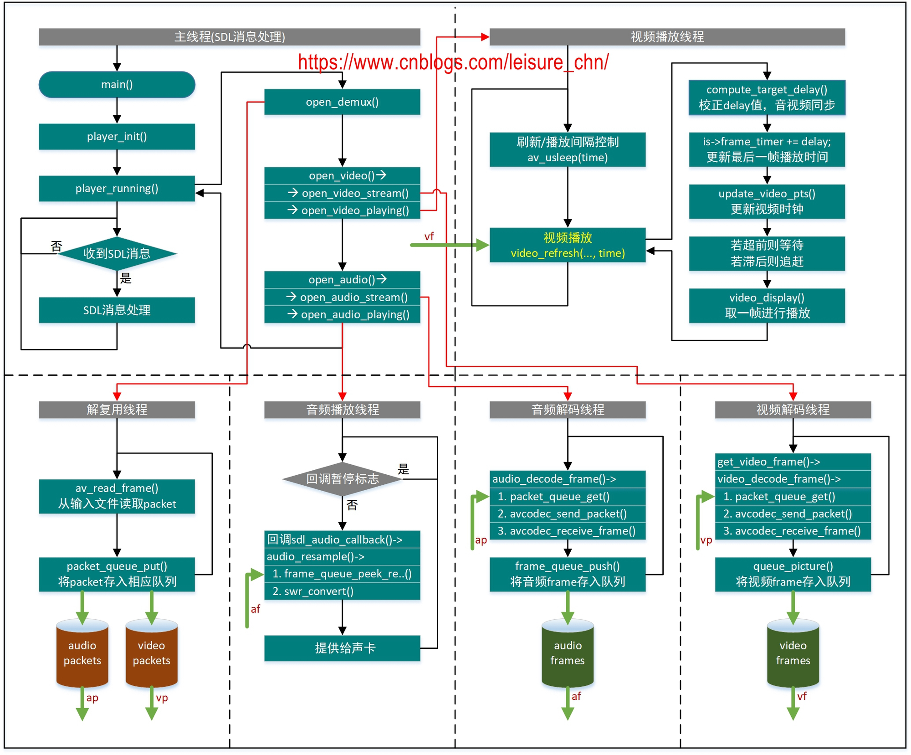

# FFplay



ffplay.exe 与ffmpeg.exe的命令行指令
[一文快速学会FFmpeg音视频编解码神器的下载安装与使用](https://www.bilibili.com/read/cv23895928/)

[ffmpeg-ffplay框架讲解](https://zhuanlan.zhihu.com/p/577158437)




视音频同步策略






音频就给外面提供我现在是播放第多少帧了

然后根据一帧播放的时间就可以判断出现在声音播放到哪了。

定义一个标准的0时间。

音频正常播放会出现丢帧问题吗？

然后，视频就根据这个0 时间还有我播放到了多少帧计算出时间去进行配对，

视频那边循环播放，每播放一帧就去对比 音乐的播放时间，

如果音量的时间快于视频，视频就丢帧

如果音频的时间慢于视频，视频就延长。

一个视频3分51秒 也就是3*60+51=231秒

帧率为29.970   

  29.97*231 =  6923.07  指令读取出来的帧数是6948

相差25帧不到一秒

 

```c
ffprobe -v error -count_frames -select_streams v:0 -show_entries stream=nb_read_frames -of default=nokey=1:noprint_wrappers=1 test.flv
```

第一次播放帧数：6863

第二次还是6863

第三次还是6863

队列里一共添加了6907个帧 但解码了6863这帧

在es中导入的帧总数为6947帧


根据计算

//  // 计算帧率
// double fps = av_q2d(pFormatCtx->streams[audioStream]->avg_frame_rate);

//  // 计算总帧数
//  int64_t total_frames = (pFormatCtx->duration / AV_TIME_BASE) * fps;

Total frames: 6923

test,mp43 927