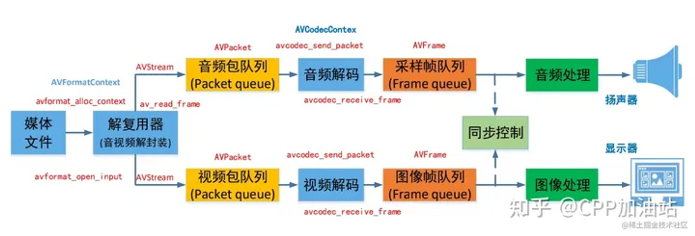
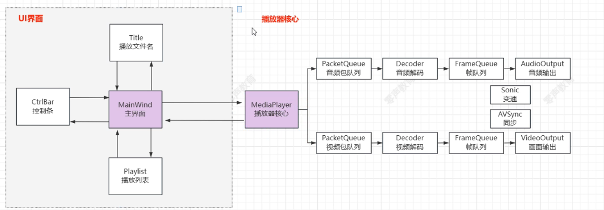
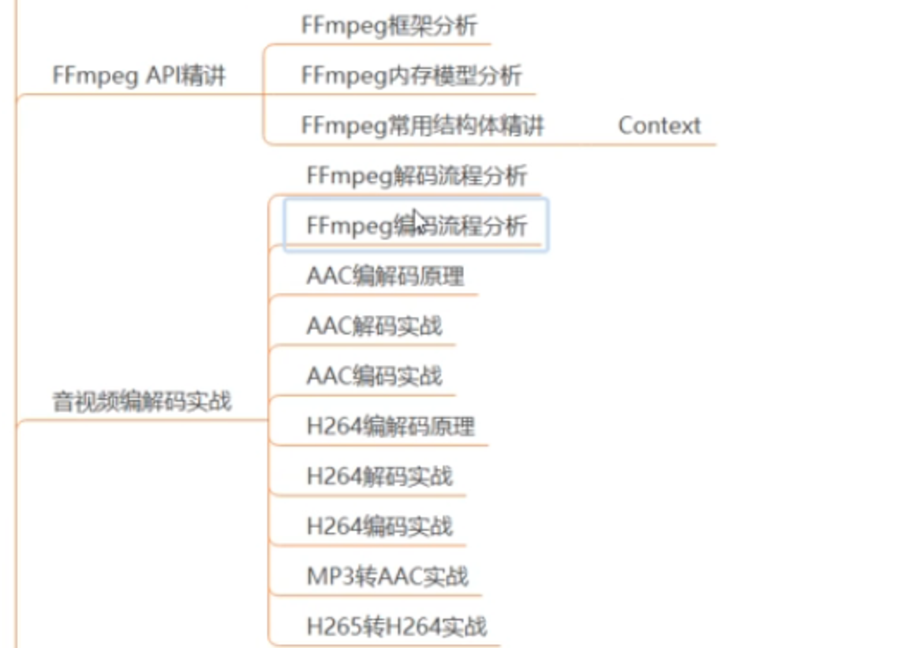
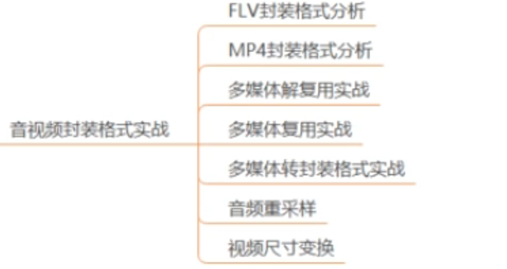
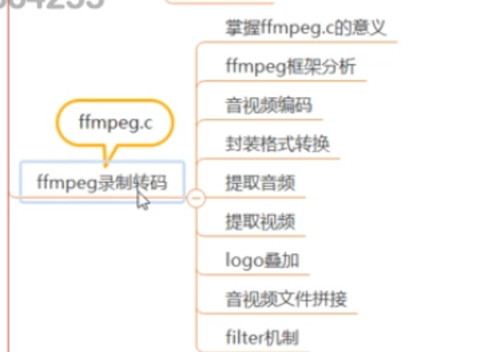
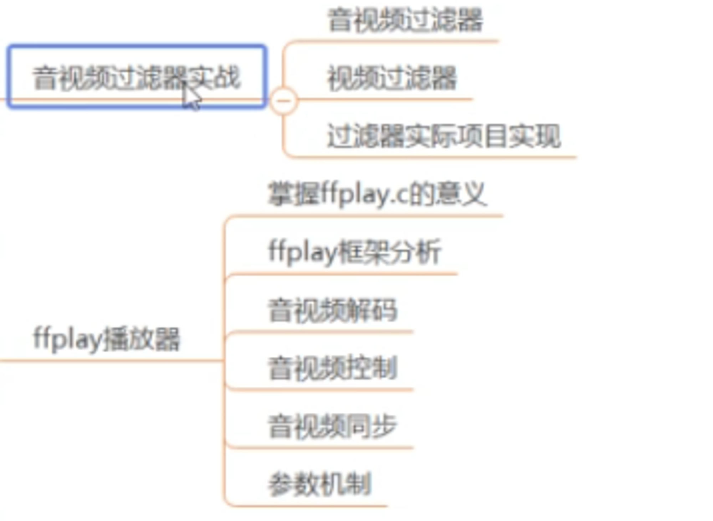

# 基本原理学习

[C/C++音视频高级开发 FFmpeg编程入门](https://juejin.cn/post/7033666766202994724)

## 音频基础

pcm :平面格式；交错模式；一帧数据有多少个采样点；一帧数据能持续播放多久

编码原理：

解复用基础

flv;mp4;ts

常用工具：Mediainfo  VLC播放器；ffmpeg;ffplay;mp4分析工具

FFmpeg 命令实战：ffmpeg.c

视频录制命令

多媒体文件的分解/复用命令 ：提取ACC PCM H264 YUV rgb 合成ACC MP4 H264

裁剪与合并命令

图片视频互转命令

各种滤镜命令

## mediainfo工具查看音视频信息

## 参考网页

[FFmpeg基础:获取音视频的各种编码参数_ffmpeg查看视频帧率-CSDN博客](https://blog.csdn.net/yinshipin007/article/details/130267709)

[基于 MCI 播放，EasyX 为界面的音乐播放器](https://codebus.cn/songxu/music-player)

[c语言音频分帧加窗谱减后输出 - CSDN文库](https://wenku.csdn.net/answer/3e3b8c04507f424abc3b5cf300d93953)

[一文快速学会FFmpeg音视频编解码神器的下载安装与使](https://www.bilibili.com/read/cv23895928/)

[playerdemo | 一个视频播放器，开源版 potplayer ，用于总结播放器开发技术。](https://itisyang.github.io/playerdemo/)

[【音视频播放器系列】ffmpeg-ffplay框架详细讲解（一） - 知乎](https://zhuanlan.zhihu.com/p/577158437)

[手把手带你实现一个FFmpeg播放器开发【ffmpeg/webrtc/rtsp..音视频流媒体开发】_哔哩哔哩_bilibili](https://www.bilibili.com/video/BV1Vh411n7mZ/?vd_source=8fbdf2f47b7c903709a3553f55787d8a)

[FFmpeg: decode_audio.c](https://ffmpeg.org//doxygen/trunk/decode_audio_8c-example.html)

[video_refresh视频播放线程分析-CSDN博客](https://blog.csdn.net/u012117034/article/details/128830341)

[FFplay的序列号源码分析—ffplay.c源码分析 · FFmpeg原理](https://ffmpeg.xianwaizhiyin.net/ffplay/serial.html)

[如何在windows10下使用vs2017编译最新版本的FFmpeg和ffplay_window ffmpeg vs2017编译-CSDN博客](https://blog.csdn.net/kejian1688/article/details/87980750)

[[QT+FFMPEG]使用QT自带的MinGW编译器编译FFMPEG生成LIB库（H264解码）_qt 编译ffmpeg-CSDN博客](https://blog.csdn.net/dashuo0501/article/details/128166736)

[音视频开发—音视频同步 - 知乎](https://zhuanlan.zhihu.com/p/624881943)

[谨慎使用DLL_THREAD_ATTACH，以及利用DLL_THREAD_ATTACH来阻止远程线程的创建执行_createthread(null, 0, threadfunc, null, 0, &dwthre-CSDN博客](https://blog.csdn.net/u011740322/article/details/10083563)

[ffplay播放器精确跳转seek控制_ffpyplayer 跳转到指定帧-CSDN博客](https://blog.csdn.net/ice_ly000/article/details/84977374)

[FFMPEGQt视频播放器之播放控制_qtffplay资源-CSDN文库](https://download.csdn.net/download/qq214517703/9631101)

[项目文件预览 - ffmpeg_video_player_tutorial - GitCode](https://gitcode.com/jiemojiemo/ffmpeg_video_player_tutorial/blob/main/tutorial07/my_tutorial07_01_accurate_seek.cpp?utm_source=csdn_github_accelerator&isLogin=1)

[Linux下交叉编译FFMPEG与X264库：目标板友善之臂Tiny4412开发板_EXYNOS4412（ARMV7_32位](https://cloud.tencent.com/developer/article/1932879)

[嵌入式linux下的FFmpeg交叉编译（最全面）-CSDN博客](https://blog.csdn.net/yyz_1987/article/details/131076072)

[交叉编译ffmpeg2.4.14 SDL1.2.15 alsa-1.1.4.1 播放音频_交叉编译sdl1.2.15库-CSDN博客](https://blog.csdn.net/shzwfq/article/details/86692918)
