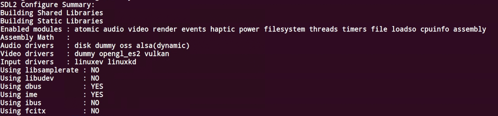

# 将FFplay 移植到Linux中实现音频播放 交叉编译

## 安装X264

<https://www.videolan.org/developers/x264.html>

```sh
./configure --prefix=$PWD/_install --disable-asm --enable-shared --enable-static --host=arm-openwrt-linux-gnueabi
```

## SDL2-2.0.8

### 下载SDL2源文件

### 编译配置

```sh
./configure --prefix=$PWD/_install --host=arm-openwrt-linux-gnueabi   --enable-shared --enable-video-dummy --enable-video-x11   --disable-video-directfb --disable-arts --disable-esd   --disable-joystick --disable-input-tslib --enable-alsa   --enable-alsa-shared --disable-pulseaudio   --with-alsa-prefix=/home/linux20/ffplay/sound/lib   --with-alsa-inc-prefix=/home/linux20/ffplay/sound/include
```

./configure
--prefix=$PWD/_install 输出路径
--host=arm-openwrt-linux-gnueabi  交叉编译器
 --enable-shared --enable-video-dummy --enable-video-x11   --disable-video-directfb --disable-arts --disable-esd   --disable-joystick --disable-input-tslib --enable-alsa   --enable-alsa-shared --disable-pulseaudio  
 选择alsa启动
  --with-alsa-prefix=/home/linux20/ffplay/sound/lib   --with-alsa-inc-prefix=/home/linux20/ffplay/sound/include
配置alsa的头文件与库文件信息

看到其中要有alsa


```sh
sudo  make -j3
sudo PATH=/usr/local/sbin:/usr/local/bin:/usr/sbin:/usr/bin:/sbin:/bin:/usr/games:/home/linux20/toolchain/bin make install
```

## FFmpeg-4.4.4

### 下载ffmpeg源码

### 配置编译

```sh
sudo PATH=/usr/local/sbin:/usr/local/bin:/usr/sbin:/usr/bin:/sbin:/bin:/usr/games:/home/linux20/toolchain/bin    ./configure --enable-shared --enable-static --cross-prefix=arm-openwrt-linux-gnueabi- --enable-cross-compile --target-os=linux  --arch=arm --prefix=$PWD/_install --enable-shared --enable-static --enable-gpl --enable-nonfree --enable-ffmpeg --enable-ffprobe --enable-ffplay  --enable-alsa  --disable-yasm --disable-vdpau --disable-xvmc --extra-cflags=-I/home/linux20/ffplay/SDL2-2.0.8/_install0/include/SDL2 --extra-ldflags=-L/home/linux20/ffplay/SDL2-2.0.8/_install0/lib  --extra-libs=-lSDL2   --extra-cflags=-I/home/linux20/ffplay/sound/include  --extra-ldflags=-L/home/linux20/ffplay/sound/lib  --extra-libs=-lasound
```

可以通过 `configure -h`查看

sudo PATH=/usr/local/sbin:/usr/local/bin:/usr/sbin:/usr/bin:/sbin:/bin:/usr/games:/home/linux20/toolchain/bin 交叉编译工具地址

./configure --enable-shared --enable-static
--cross-prefix=arm-openwrt-linux-gnueabi-  
交叉编译器前缀
--enable-cross-compile --target-os=linux  --arch=arm
目标机系统 arm结构
--prefix=$PWD/_install
输出文件地址
--enable-shared --enable-static --enable-gpl --enable-nonfree
--enable-ffmpeg --enable-ffprobe --enable-ffplay  
生成工具
--enable-alsa  --disable-yasm --disable-vdpau --disable-xvmc
选择的alsa音频驱动  取消选择vdpau、xvmc（编译时会错误）
 --extra-cflags=-I/home/linux20/ffplay/SDL2-2.0.8/_install0/include/SDL2 --extra-ldflags=-L/home/linux20/ffplay/SDL2-2.0.8/_install0/lib  --extra-libs=-lSDL2   --extra-cflags=-I/home/linux20/ffplay/sound/include  --extra-ldflags=-L/home/linux20/ffplay/sound/lib  --extra-libs=-lasound
-extra-cflags、 --extra-ldflags 是显示指示模块的头文件与库文件的位置。
-extra-libs是指定链接到哪个库文件，如果不指定，应该是使用在配置文件里已经设置了的默认值

* 选择SDL2库和alsa库

### FFplay

在ffbuild目录下的config.mak，则表示可以生成ffplay
`CONFIG_FFPLAY=yes`

### 编译

```sh
sudo PATH=/usr/local/sbin:/usr/local/bin:/usr/sbin:/usr/bin:/sbin:/bin:/usr/games:/home/linux20/toolchain/bin STAGING_DIR=/home/linux20/toolchain/arm-openwrt-linux/bin/  make
```

```sh
sudo PATH=/usr/local/sbin:/usr/local/bin:/usr/sbin:/usr/bin:/sbin:/bin:/usr/games:/home/linux20/toolchain/bin STAGING_DIR=/home/linux20/toolchain/arm-openwrt-linux/bin/  make install
```

## alsa 移植

## 目标机运行
