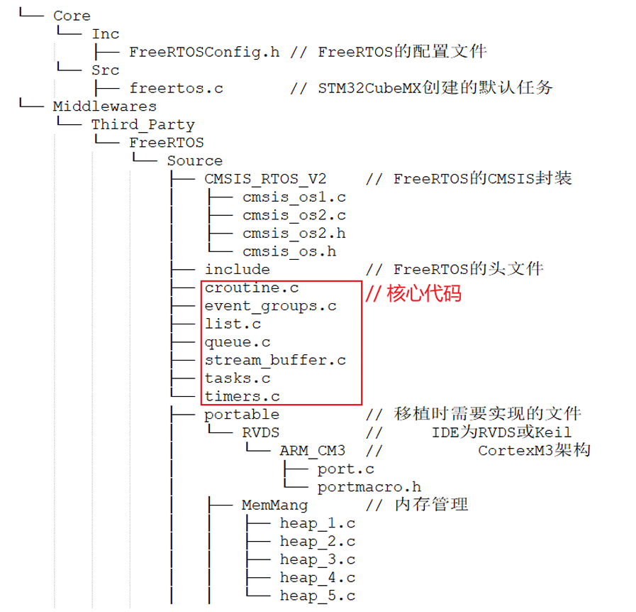

# FreeRTOS概述

## 核心功能


## FreeRTOS目录结构


主要两个目录:

- core:
    Inc目录下的FreeRTOSConfig.h是配置文件
    Src目录下的freertos.c是STM32CubeMX创建的默认任务

- Middlewares\Third_Party\FreeRTOS\Source
    根目录下是核心文件，这些文件是通用的
    portable 目录下是移植时需要实现的文件
    目录名为：[compiler]/[architecture]：
    RVDS/ARM_CM3，这表示cortexM3 架构在RVDS 工具上的移植
文件

## 核心文件

FreeRTOS/Source/tasks.c  任务操作
FreeRTOS/Source/list.c 列表

次要：
queue.c 队列操作，信号量操作 semaphore
timer.c software timer
event_groups.c 提供event group功能

## 头文件相关

FreeRTOS需要3个头文件目录：
    FreeRTOS本身的头文件：
        Middlewares\Third_Party\FreeRTOS\Source\include
    移植时用到的头文件：
        Middlewares\Third_Party\FreeRTOS\Source\portable\[compiler]\[architecture]  
    含有配置文件FreeRTOSConfig.h的目录：Core\Inc

- FreeRTOSConfig.h
    FreeRTOS 的配置文件，比如选择调度算法：
    configUSE_PREEMPTION
    每个demo都必定含有FreeRTOSConfig.h
- FreeRTOS.h
    使用FreeRTOS API 函数时，必须包含此文件。
    在FreeRTOS.h 之后，再去包含其他头文件，比如：task.h、queue.h、semphr.h、event_group.h

## 内存管理

Middlewares\Third_Party\FreeRTOS\Source\portable\MemMang文件下.它也是放
在“portable”目录下，表示你可以提供自己的函数。

源码中默认提供了5个文件，对应内存管理的5种方法。

heap_1.c   优点：分配简单，时间确定                缺点:只分配、不回收
heap_2.c 优点：动态分配、最佳匹配                缺点:碎片、时间不定
heap_3.c 优点：调用标准库函数                    缺点:速度慢、时间不定
heap_4.c 优点：相邻空闲内存可合并                缺点:可解决碎片问题、时间不定
heap_5.c 优点：在heap_4 基础上支持分隔的内存块    缺点:  可解决碎片问题、时间不定

## 入口函数

在Core\Src\main.c 的 main 函数里，初始化了FreeRTOS环境、创建了任务，然后启动
调度器

```c
/* Init scheduler */ 
osKernelInitialize();  /* 初始化FreeRTOS运行环境 */ 
MX_FREERTOS_Init();    
/* 创建任务 */ 
/* Start scheduler */ 
osKernelStart();       
/* 启动调度器 */ 
```

## 数据类型和编程规范
