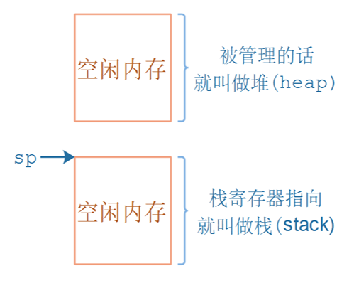
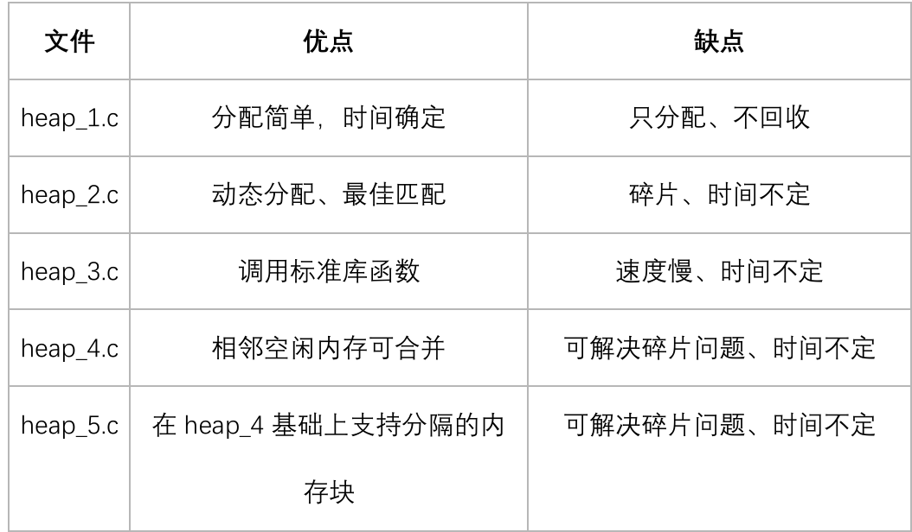
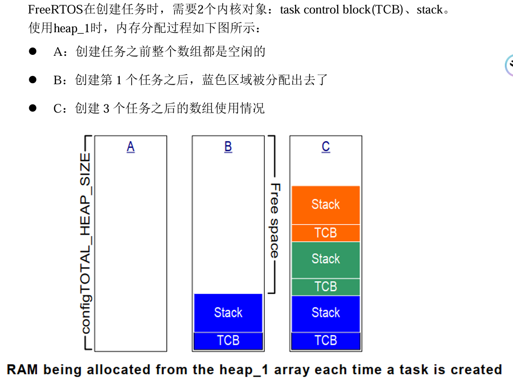
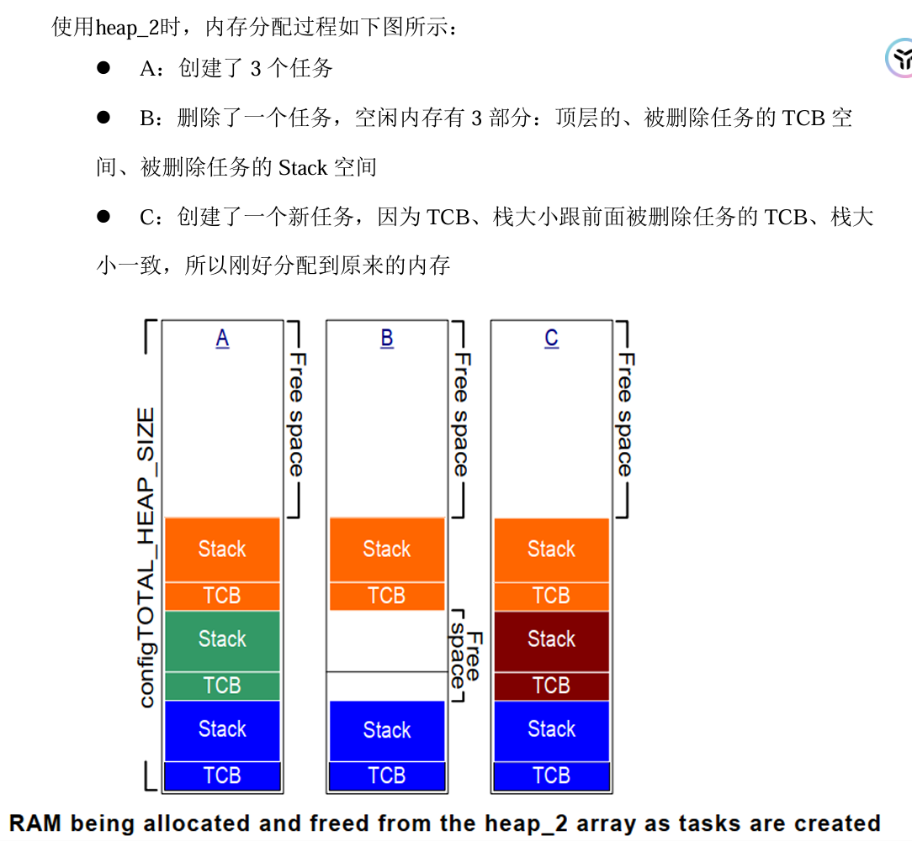
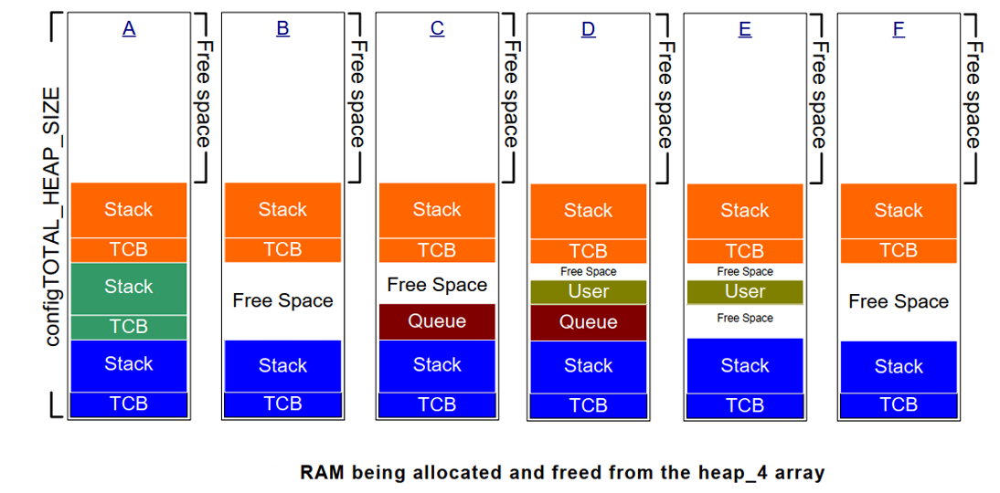

# 内存管理

## 为什么实现内存管理

在C语言的库函数中，有mallc、free等函数，但是在FreeRTOS中，它们不适用：
⚫ 不适合用在资源紧缺的嵌入式系统中
⚫ 这些函数的实现过于复杂、占据的代码空间太大
⚫ 并非线程安全的(thread-safe)
⚫ 运行有不确定性：每次调用这些函数时花费的时间可能都不相同
⚫ 内存碎片化
⚫ 使用不同的编译器时，需要进行复杂的配置
⚫ 有时候难以调试

堆和栈

- 堆，heap，就是一块空闲的内存，需要提供管理函数
    malloc：从堆里划出一块空间给程序使用
    free：用完后，再把它标记为"空闲"的，可以再次使用
- 栈 stack，函数调用时局部变量保存在栈中，当前程序的环境也是保存在栈中
    可以从堆中分配一块空间用作栈



## 五种内存管理方法

[FreeRTOS说明书吐血整理](https://blog.csdn.net/qq_43212092/article/details/104845158)



### heap1



### heap2

最佳匹配算法



### heap3

Heap_3 使用标准C库里的malloc、free函数，所以堆大小由链接器的配置决定，配置
项configTOTAL_HEAP_SIZE 不再起作用。 
C库里的malloc、free函数并非线程安全的，Heap_3中先暂停FreeRTOS的调度器，再去
调用这些函数，使用这种方法实现了线程安全

### heap4

首次适应算法


### heap5

## Heap相关函数

### pvPortMalloc/vPortFree

函数原型：

```c
void * pvPortMalloc( size_t xWantedSize );
void vPortFree( void * pv );
```

作用：分配内存、释放内存。
如果分配内存不成功，则返回值为NULL

### xPortGetFreeHeapSize

函数原型：

```c
size_t xPortGetFreeHeapSize( void ); 
```

当前还有多少空闲内存，这函数可以用来优化内存的使用情况。比如当所有内核对象都
分配好后，执行此函数返回2000，那么configTOTAL_HEAP_SIZE就可减小2000

### xPortGetMinimumEverFreeHeapSize

函数原型：

```c
size_t xPortGetMinimumEverFreeHeapSize( void ); 
```

返回：程序运行过程中，空闲内存容量的最小值。
注意：只有heap_4、heap_5支持此函数

### malloc 失败的钩子函数

```c
在pvPortMalloc 函数内部： 
void * pvPortMalloc( size_t xWantedSize )vPortDefineHeapRegions 
{ 
...... 
#if ( configUSE_MALLOC_FAILED_HOOK == 1 ) 
{ 
    if( pvReturn == NULL ) 
{ 
extern void vApplicationMallocFailedHook( void ); 
    vApplicationMallocFailedHook(); 
} 
} 
#endif 
return pvReturn;         
}
```

所以，如果想使用这个钩子函数：
在FreeRTOSConfig.h 中，把configUSE_MALLOC_FAILED_HOOK 定义为1  提供vApplicationMallocFailedHook 函数
pvPortMalloc 失败时，才会调用此函数
