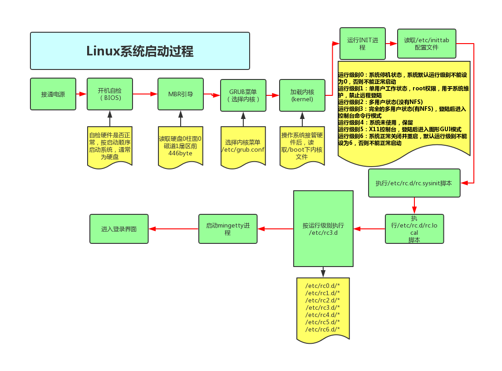
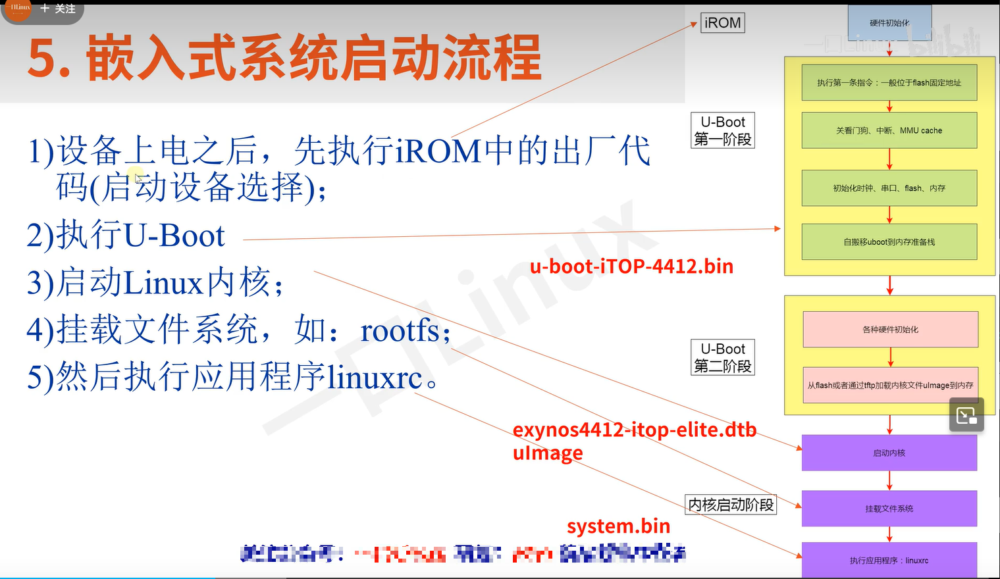
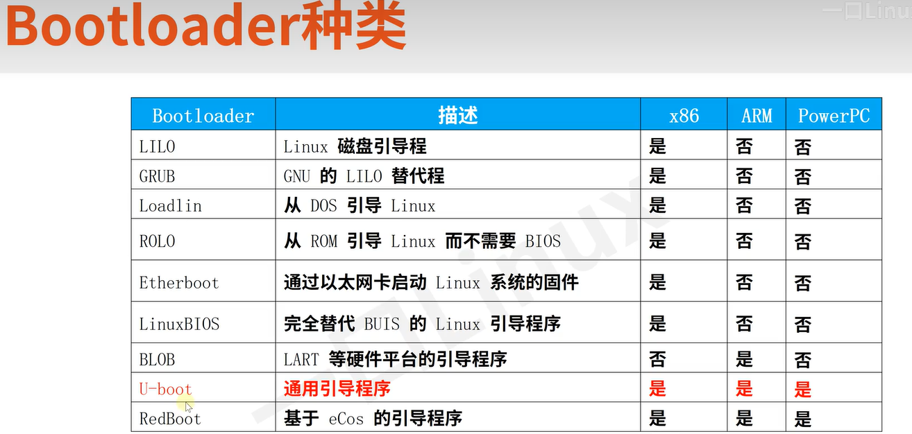

# linux 启动

## linux 启动流程


### 1. 硬件初始化（BIOS/UEFI阶段）

- BIOD/UEFI

当计算机启动时，BIOS（基本输入输出系统）或UEFI（统一可扩展固件接口）胡执行硬件初始化，进行硬件自检（POST），并查找启动设备如硬盘SSD

- 加载引导程序

BIOS、UEFI 会将控制权交给引导加载程序（如GRUB,LILO），从启动设备的主引导记录（MBR）或GPT（GUID分区表）中加载引导加载程序。

### 2.引导加载程序阶段

- 第一阶段引导加载程序
  
    这是一个简单的程序，主要打任务是加载并执行第二阶段加载程序。通常位于MBR中（446字节），负责从启动盘加载第二阶段引导加载程序

- 第二阶段引导加载程序

    更复杂，能够理解文件系统，从而加载操纵系统内核，常见的第二阶段引导加载程序是GURB

    GURB:GRUB允许用户选择启动不同的内核版本或操作系统，并提供一个简易的命令行界面来进行修复和调试。

    内核加载：GRUB加载并解压缩内核镜像（通常是vmlinuz文件），并将其加载到内存中。随后，它还会加载一个初始的临时根文件系统（initrd或initramfs）。
    initramfs意义：挂在磁盘需要驱动，引导加密磁盘，网络引导，其他需要额外模块的引导流程

### 3.内核初始化阶段

内核启动：内核被加载到内存后，控制权被转交给内核。内核开始自解压，并进行系统初始化。

**硬件检测和初始化**：内核探测并初始化所有硬件设备，如CPU、内存、I/O设备等。
**设备驱动加载**：内核加载必要的设备驱动程序，以便与硬件进行交互。
**内存管理初始化**：内核初始化内存管理子系统，设置虚拟内存和页表。
**进程调度器启动**：内核初始化进程调度器，并开始管理系统中的进程。
**文件系统挂载**：内核挂载初始临时根文件系统（initrd或initramfs），这是一个压缩的根文件系统，包含基本的系统启动程序和配置文件。

### 4. 用户空间初始化阶段

- init进程启动：内核从初始根文件系统中加载并启动第一个用户1空间进程——init（PID 1）。init进程是所有用户进程的祖先。

    **initrd/initramfs切换**：init进程执行基本系统初始化后，会挂载真正的根文件系统（通常位于硬盘上），然后切换到这个根文件系统。
    **启动系统服务和守护进程**：init进程根据其配置文件（如/etc/inittab、/etc/init.d/、/etc/systemd/等）启动各种系统服务和守护进程。

### 5. 系统管理工具和用户登录

- systemd/system V init：现代Linux系统通常使用systemd作为系统和服务管理器。systemd管理系统启动过程中的各个阶段，启动并管理系统服务，处理系统日志等。

    **多用户目标**：systemd启动多用户目标（multi-user.target），这是一个类似于旧版init的运行级别（runlevel 3），包含网络服务和其他多用户功能。

    **图形界面目标**：如果启用了图形界面（GUI），systemd会启动图形界面目标（graphical.target），这是一个类似于旧版init的运行级别（runlevel 5），启动显示管理器（如GDM、LightDM）。

### 6. 用户登录

**登录提示**：系统启动完成后，用户会看到登录提示（login prompt），可以通过控制台或图形界面登录到系统。

**用户会话启动**：用户成功登录后，系统启动用户会话，加载用户配置文件，并启动桌面环境或命令行界面。

## 嵌入式系统启动流程





LILO GURB U-boot 均属于bootloader

uboot烧录文件：U-boot 、uImage、dtb、system.img

## UBOOT

U-Boot（全称为 Universal Boot Loader）是一个开源的引导加载程序，广泛应用于嵌入式系统中。它的主要功能是初始化硬件并加载操作系统内核。以下是对U-Boot的详细介绍：

### U-Boot 的主要功能

- 硬件初始化

在系统上电或复位后，U-Boot负责初始化基本硬件组件，例如CPU、内存、串口、网络接口和存储设备。

- 引导操作系统

U-Boot从指定的存储设备（如NAND/NOR闪存、SD卡、eMMC等）中加载操作系统内核（例如Linux内核）到内存中，然后将控制权转交给内核。

- 提供命令行界面

U-Boot提供一个交互式的命令行界面，用户可以通过串口或网络接口进行访问。通过命令行界面，用户可以进行各种系统操作，例如内存读写、环境变量设置、文件系统操作和网络通信等。

- 网络引导

U-Boot支持通过网络协议（如TFTP、NFS）从远程服务器加载内核和文件系统映像，便于系统的远程升级和维护。

- 存储设备管理

U-Boot支持多种存储设备和文件系统（如FAT、EXT2/3/4），可以从这些存储设备中读取内核和其他必要的启动文件。

- 环境变量

U-Boot使用环境变量来存储启动配置和参数，例如启动设备、内核映像位置、启动命令等。这些环境变量可以通过命令行界面进行设置和修改

### U-Boot 的启动流程

- 上电和硬件复位

当系统上电或复位后，硬件会跳转到U-Boot的入口地址执行代码。

- 板级初始化（Board Initialization）

U-Boot首先进行低级硬件初始化，这包括设置时钟、初始化DDR内存控制器、配置引脚复用等。

然后，U-Boot会初始化串口，以便输出调试信息。

- 加载和执行阶段 1（SPL）

在某些系统中，U-Boot被分为两个阶段：SPL（Secondary Program Loader）和U-Boot主程序。SPL是一个精简的引导加载程序，用于初始化基本硬件并加载U-Boot主程序。

SPL会从存储设备中加载U-Boot主程序到内存中，并跳转执行。

- 加载和执行阶段 2（U-Boot主程序）

U-Boot主程序负责完成更高级别的硬件初始化，加载内核映像和设备树文件等。

- 环境变量加载

U-Boot加载环境变量，这些变量包含启动参数和配置。

- 执行启动命令

根据环境变量中的启动命令，U-Boot加载操作系统内核，并将控制权转交给内核。

### U-Boot 的配置和编译

配置：U-Boot通过配置文件和编译选项进行定制，以适应不同的硬件平台和启动需求。配置文件通常位于configs/目录下。

编译：U-Boot使用GNU Make进行编译。典型的编译过程如下：

```sh

make <board_name>_defconfig  # 配置目标板
make  # 编译U-Boot
```

U-Boot 的使用示例

- 查看环境变量：

```sh
printenv
```

- 设置环境变量

```sh
setenv bootargs 'console=ttyS0,115200 root=/dev/mmcblk0p1 rw'
```

- 保存环境变量：

```sh
saveenv
```

- 加载并启动内核

```sh
load mmc 0:1 0x80000000 /boot/uImage
bootm 0x80000000
```

总结
U-Boot 是一个功能强大的引导加载程序，广泛应用于嵌入式系统中。它提供了丰富的功能和灵活的配置选项，能够适应各种复杂的启动需求。在嵌入式系统开发中，掌握U-Boot的使用和配置是非常重要的技能。
