# 使用CubeMX创建F103工程模板

课程流程

- 项目流程

## LED和按键原理概述

- LED:

- Key:

## OLED

- 结构

- I2C协议

硬件连接

I2C传输数据格式
一主多从

 写操作
    
 读操作
    
 I2C信号
    
    
    避免主从两端同时控制避免烧机
    
I2C底层驱动
    
    
    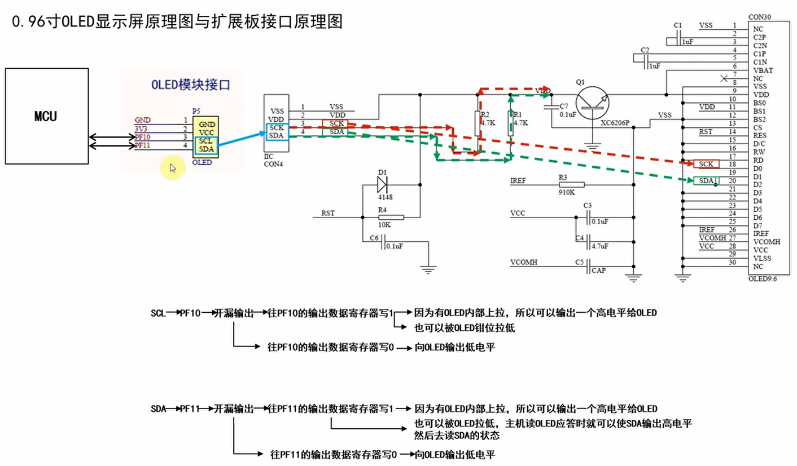
SSD1306的I2C数据格式和显存访问
   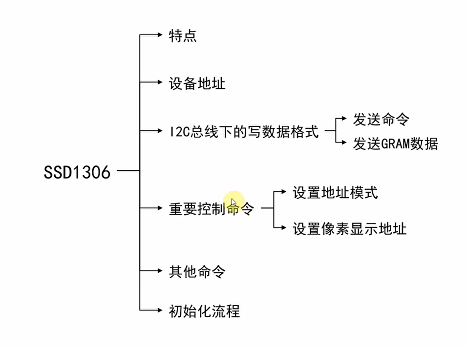
   
   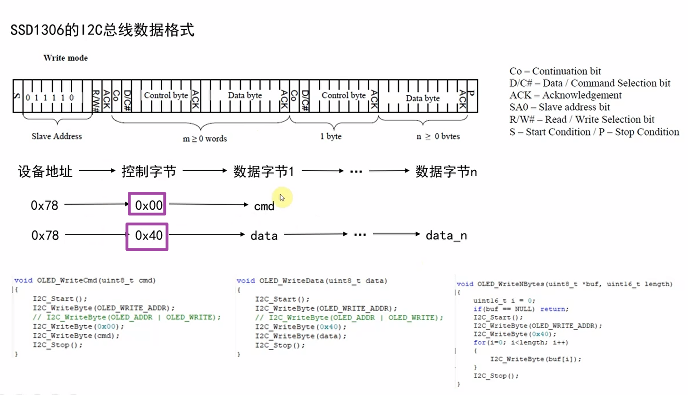
   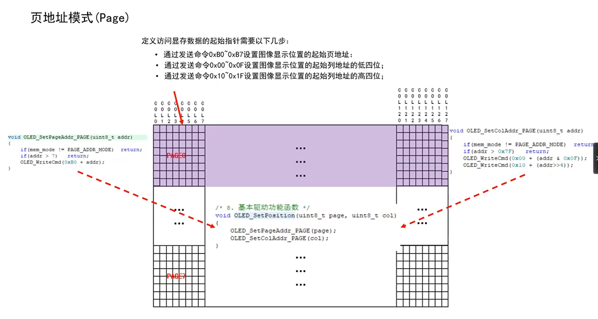
   
显示器驱动开发与显示应用

## 串口通信

   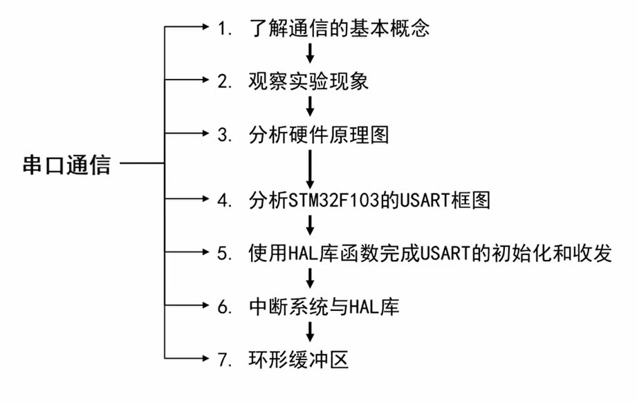
   基本概念
   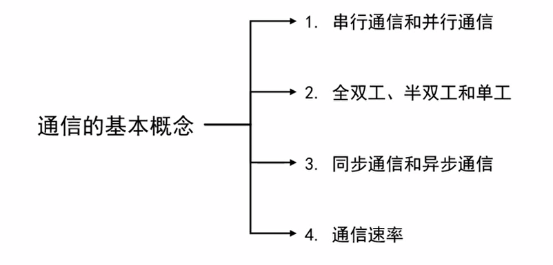
   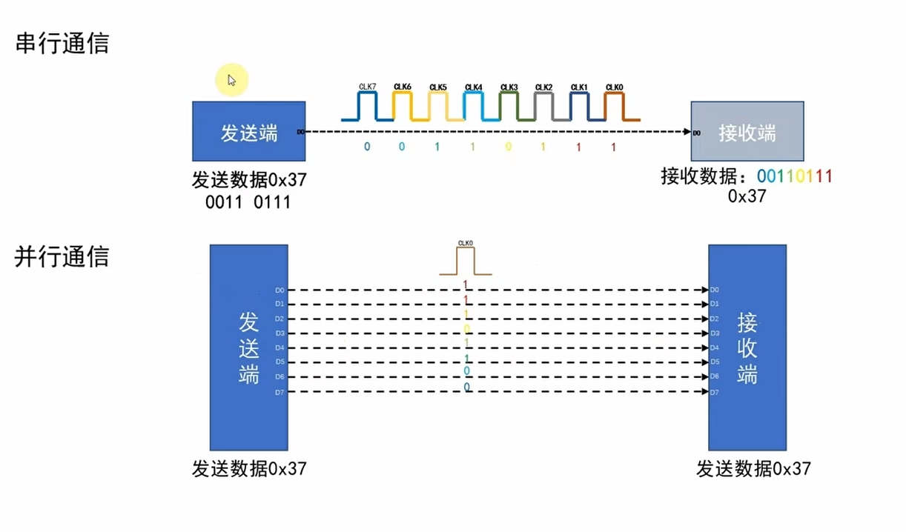
   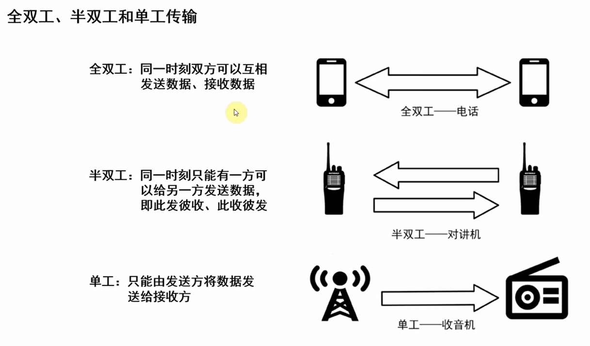
   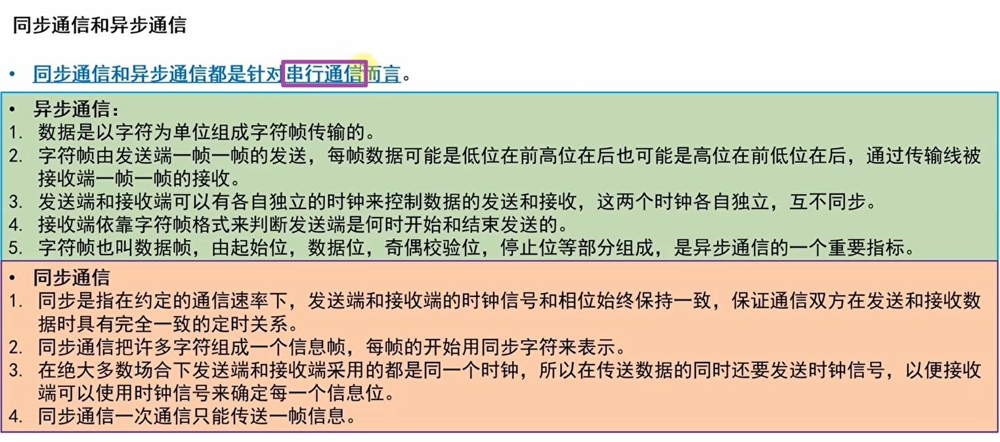
   
   
   
   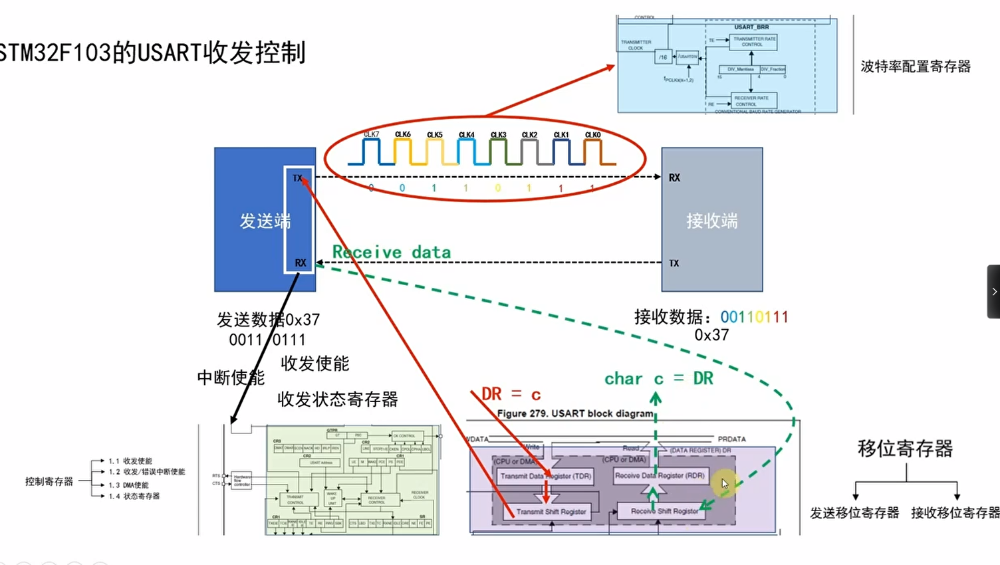
   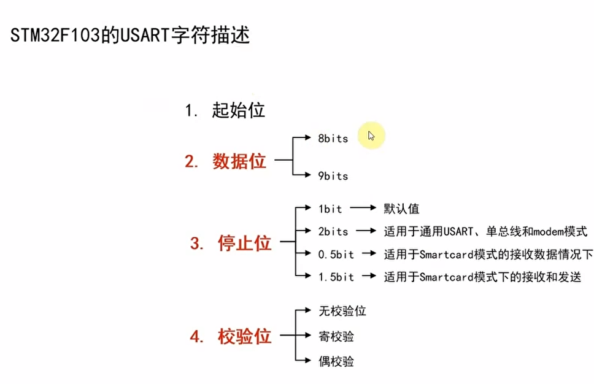