# C语言基础

## 基础知识

1. 数据类型：char,int,long,signed,unsigned,float,double,sizeof()
2. 运算与控制
3. 数据存储: static,const,const,volatile
4. 结构:struct.union,enum,typedef
5. 位操作与逻辑运算:<< ,>>,&,|,~,^
6. 预处理

位、字节、字关系
位：
字节
字word:计算机进行数据处理和运算的单位，32位中4字节=1字，64位中，8字节=1字

## 进制转换

二进制 0b
八进制 oct
十进制 dec
十六进制 hex

C语言中，变量只能由数字、字母、下划线构成，且必须由字母开头。

## 位运算

"<<":左移：高位丢弃，低位补零，每次左移相当于乘以2

">>"右移：低位丢弃，高位补零。每次右移相当于除以2

~ 取反：0变1，1变0

& 与运算：双方都为1，才为1否则为0

| 或运算：双方只有一个1，结果就为1

让GPIO_7和GPIO_9输出高电平
volatitlr unsigned int *pGpiodObr =；
*pGpiodbr |= ((1<<7)|(1<<9));
让GPIO_7和GPIO_9输出低电平
*pGpiodbr &=~((1<<7)|(1<<9));
获取GPIO_7当前状态
if(*pGpiodvr & (1<<7))
{
    a=1;
}else
    a=0;

## 封装寄存器

volatile unsigned int *pGpiobOdr =(volatile unsigned int *)(0x40010c00+0xc0);

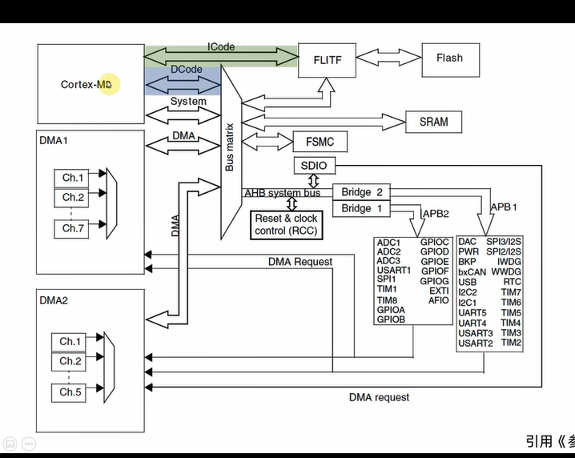
STM32
存储器与IO 外设采用统一编址
空间分为8快，每块512M ，总计8G
卡中Block2用于片上外设0x4000 0000 ~0x5fff ffff
GPIOB挂在APB2下，0x40001 0c00~0x4001 0fff

volatile unsigned int *pGpiobOdr =(volatile unsigned int *)(0x40010c00+0xc0);

volatile:声明从原始地址取值，告诉编译器不要应为优化而忽略这个指令，必须每次读取数据都从地址上直接读取值，确保每次读取值都读取到最新的值
unsigned int 声明数据类型为无符号整型
*pGpiobOdr：声明指针变量
(volatile unsigned int *)强制转化数据类型
(0x40010c00+0xc0)存储的地址，寄存器地址


## 函数指针

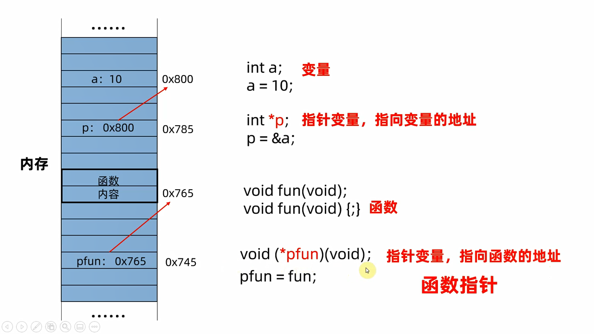

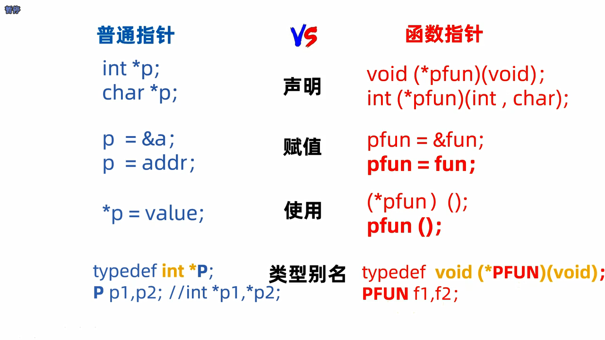

"""
//加法函数
int add(int a,int b )
{
    return a+b;
}
int sub(int a ,int b)
{
    return a-b;
}
#if 1
//定义函数指针别名
typedef int(*pfun)(int,int);

//计算函数
int calc(pfun fp)(int,int)
{
    return fp(a,b);
}
#else
    //不定义函数指针别名
    //typedef int(*pfun)(int,int);

    //计算函数
    //int calc(pfun fp)(int,int)
    //{
    //return fp(a,b);
    //}
#endif

int main(void)
{
    int c;
    c=calc(add,5,3);
    c=calc(sub,5,3);
    return 0;
}

"""

## 链表

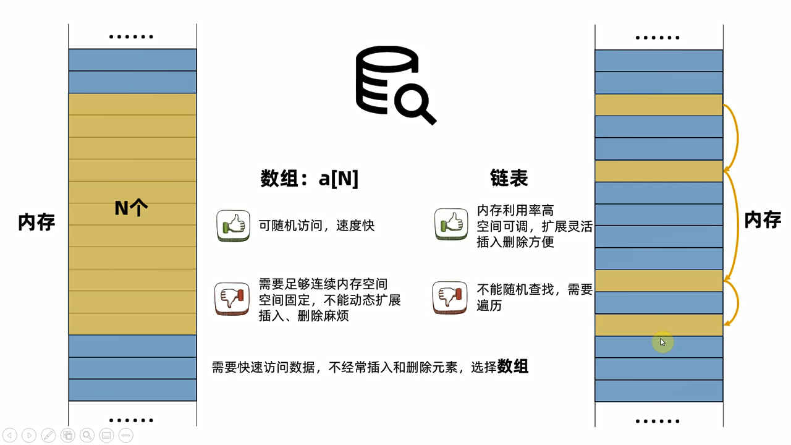
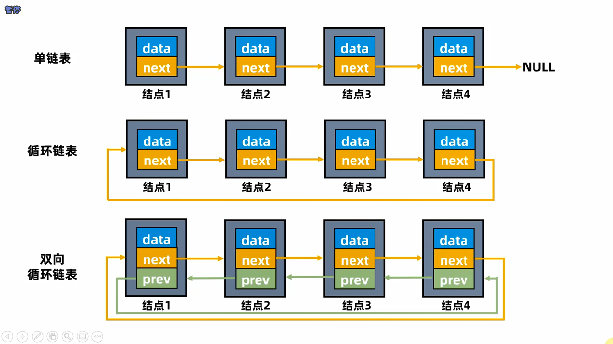
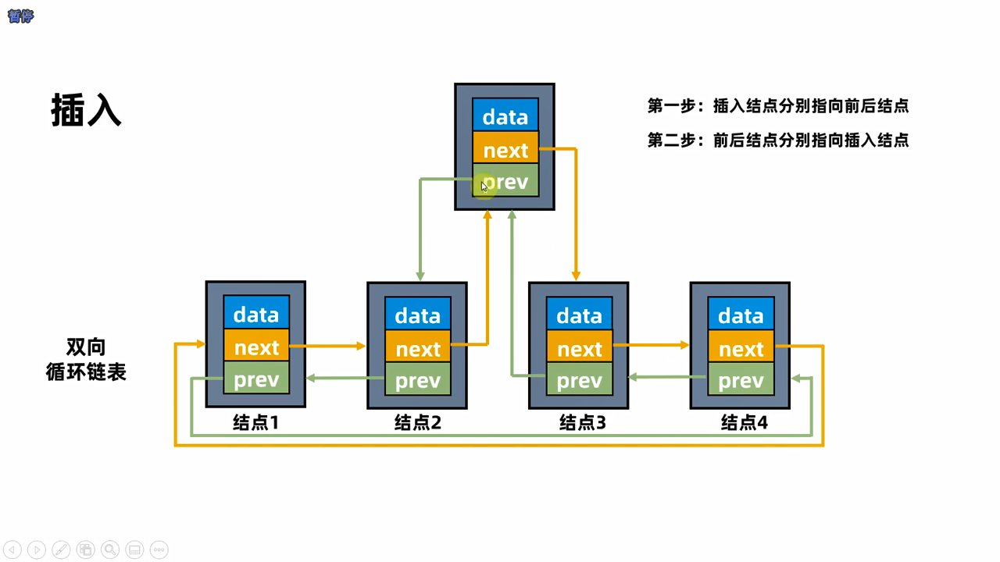
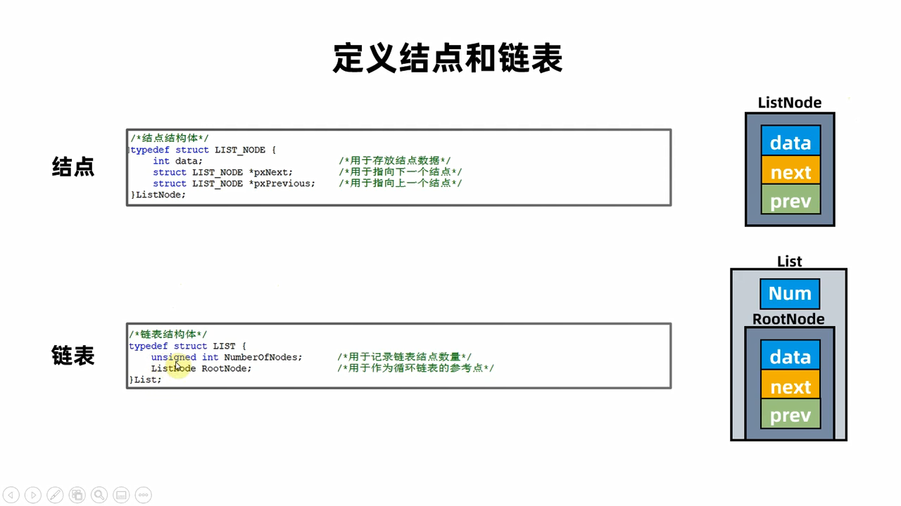
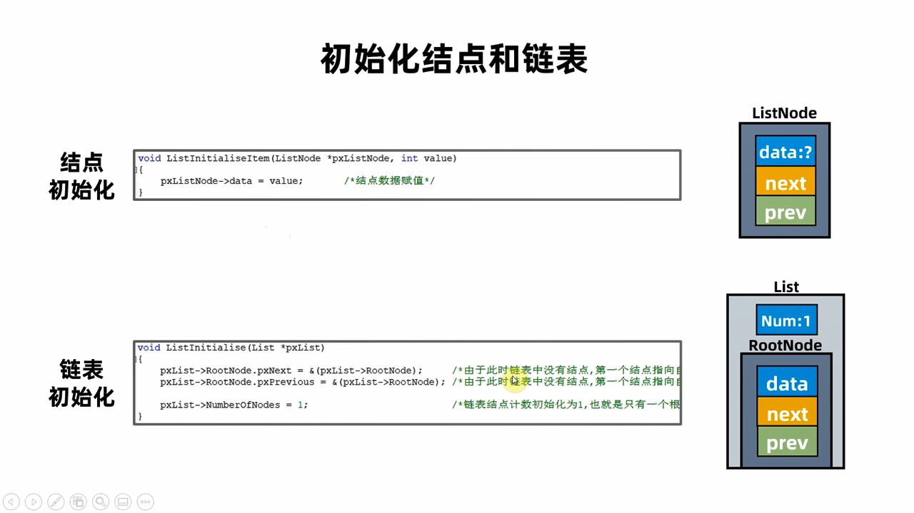
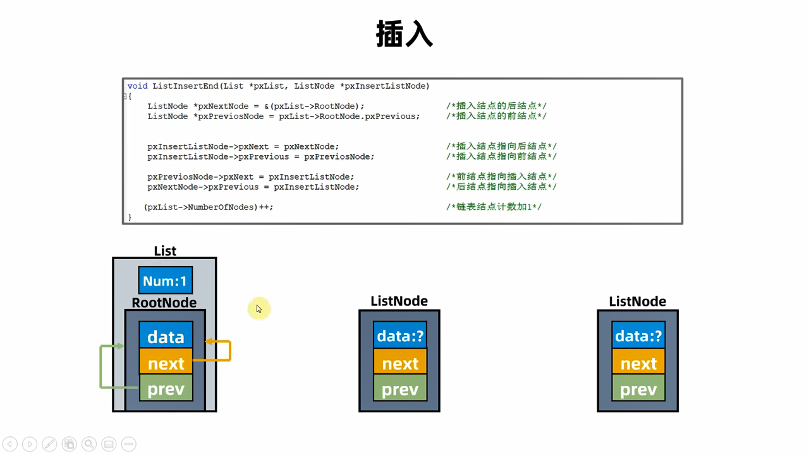
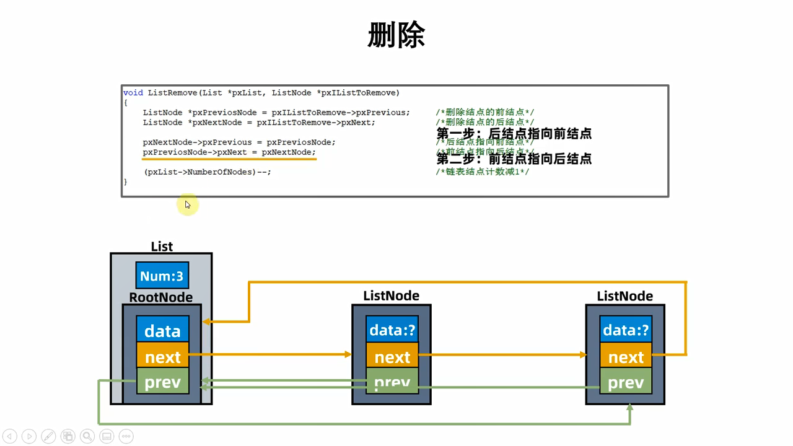

## 扩展_指针与变量

## C语言本质

volatile 防止声明变量没使用直接被优化了

### arm架构与汇编简明教程

    硬件结构

        test.c->编译器->test.zxf/test.bin/test.hex->烧写->flash

    CPU 寄存器
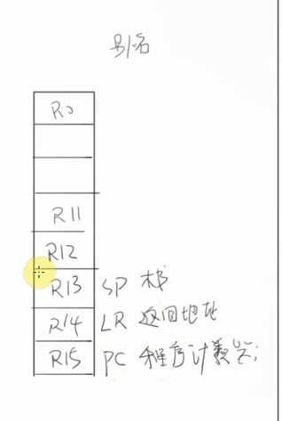
    ARM汇编
     读 load LDR   LDR R0,[ADDA] RO源，读地址 将地址数据读到ro中去
     写 store STR  STR RO,[ADDA] 将ro数据写导地址中去
     加 ADD   ADD RO,RO,#1 ->>RO=RO+1

### 变量是什么

```
#include "main.h"
int g_a=123;
int add_val(volatile int v)
{
    volatile int a=321;
    v=v+a;
    return v;
}
int mymian()
{
    static volatile int s_a=1;
    volatile int b=456;
    b=add_val(s_a);
    return b;
}
```

- 变量，能变，就能读能写，必定在内存中

- 全局变量、局部静态变量：如何分配内存、如何赋初始值

- 局部变量：如何分配空间、如何赋初始值。

局部静态变量
***局部变量***
：在栈里，临时分配空间，函数使用完收回去，

栈是什么？
谁分配栈，如何分配栈？
如何使用栈？
栈的使用图：
栈是程序员自己制定的内存，内存的最上面是栈低，然后向下入栈。内存的最下面是给全局和静态变量使用。
BL 跳转指令 branch and link
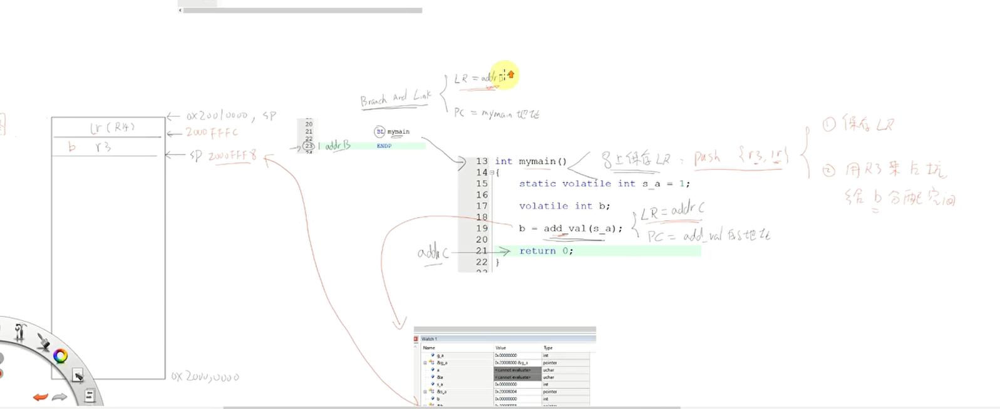
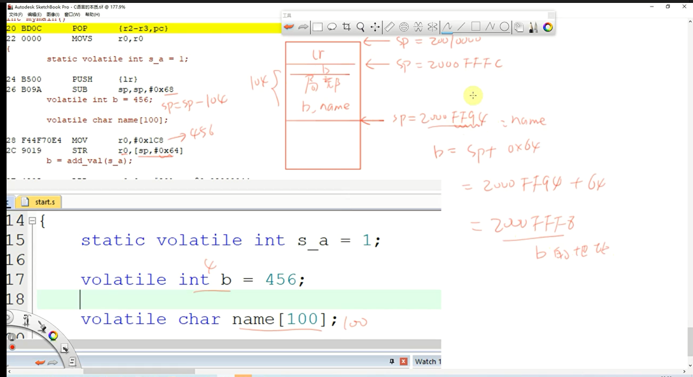
局部变量回收：推出的时候，退栈 回收空间。
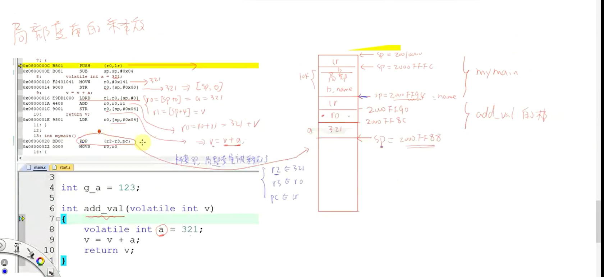

***全局变量***
最开始没有指令初始化他们，
如果向局部变量一样初始化他们，会造成大量资源浪费
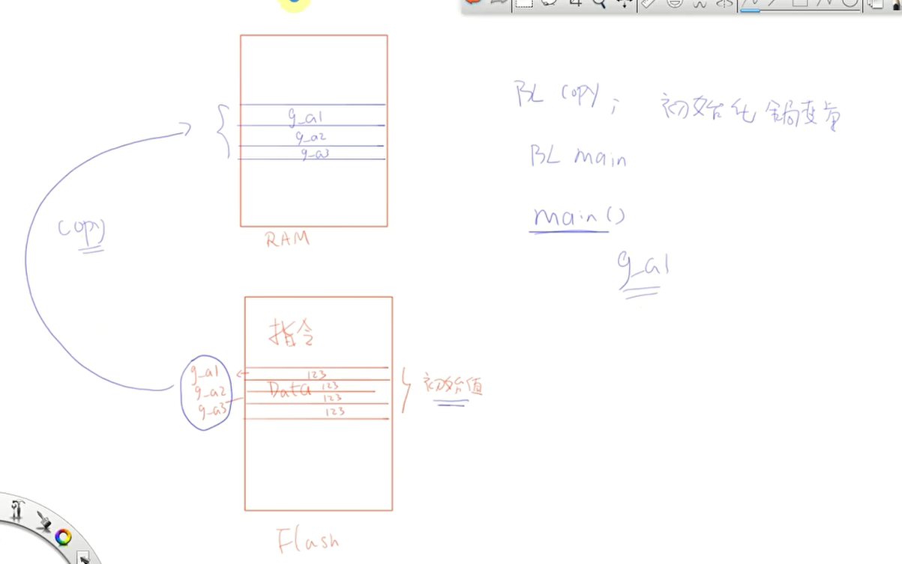
在main函数之前，需要先运行一个copy函数，将flash中的全局变量copy到内存中去。
那么问题，复制到内存哪里？
全局变量由系统和编译器分配
keil中连接器linker指定了flash和内存地址
全局变量由链接器中的参数决定的  -ro-base 0x08000000(flash)  -rw-base 0x02000000(内存)

静态变量是分配与使用和全局变量是完全一样的。
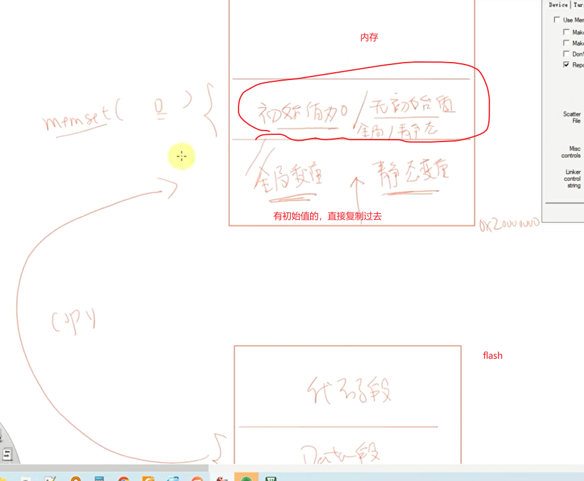

BL copy :data端
BL setzero :zi端

### 堆和栈是什么？

栈是什么东西?栈的初始值是：
向下增长，估计栈大小，寻找“使用局部变量”最多的调用链；选出空闲的作用链。

一个程序有几个栈？一个程序有多个线程，每个线程都有一个栈。裸机程序就一个栈。
堆是什么？
堆是一块空闲内存，可以使用malloc和free来管理他们；

```
char *str ；
str=malloc(100);
strcpy(str ,"123");

free(str);
```

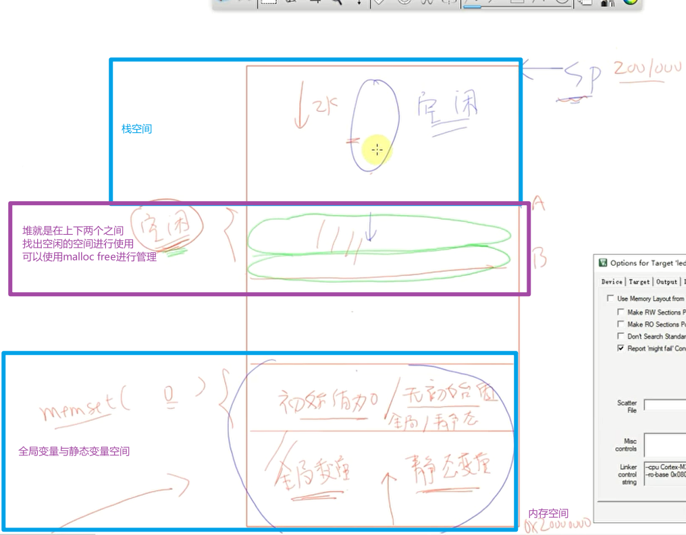

freertos中的堆就是申请了一块巨大的内存去使用。
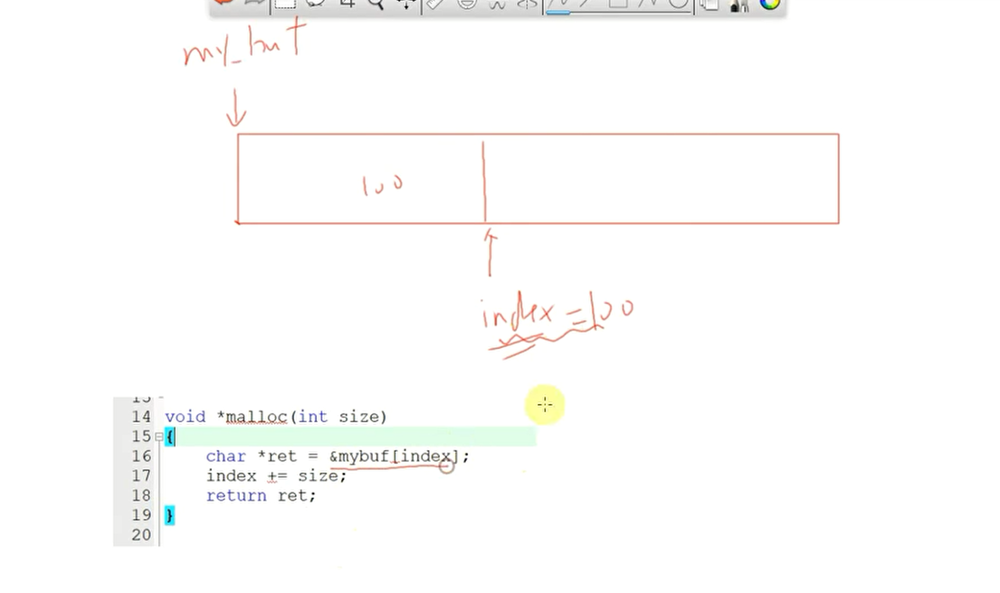

\\192.168.1.20\ims\嵌入式文档\韦东山90天双系统\3--【项目1】02_环境搭建及C语言基础\20--[视频]直播公开课_09_答疑.mp4 未看

### 函数是什么

就是一系列的指令，是一系列的机器码
调用函数：让CPU 的pc寄存器等于一系列机器码的首地址，就是函数首地址
函数怎么传递参数：将参数值赋值给R0 ，然后进入函数后，将r0的值取出来使用。
    为什么子函数无法修改实参？
    怎么让子函数修改调用者的变量？

### 指针是什么

指针变量，也是一个变量，存放的是首地址，4字节变量

使用指针的本质：跟变量访问做对比

函数指针的本质：

### 结构体是什么

- 声明结构体类型：会占用内存吗？
  


- 结构体里的成员
    里面的成员如何排序
    对齐：为何需要对齐，需要我们指定对齐吗？
- 结构体里的位成员
- union
  联合体

```C++
struct dog {
    int age;
    union{
        int kg;
        int liang;
    }weight;
}
volatile struct dog wangcai;
wangcai.age=1;
wangcai.weight.kg=1;
wangcai.weight.liang=30;


struct dog {
    int age;
    union{//联合体大小为4，最大的
        char kg;
        int liang;
    }weight;
}

```

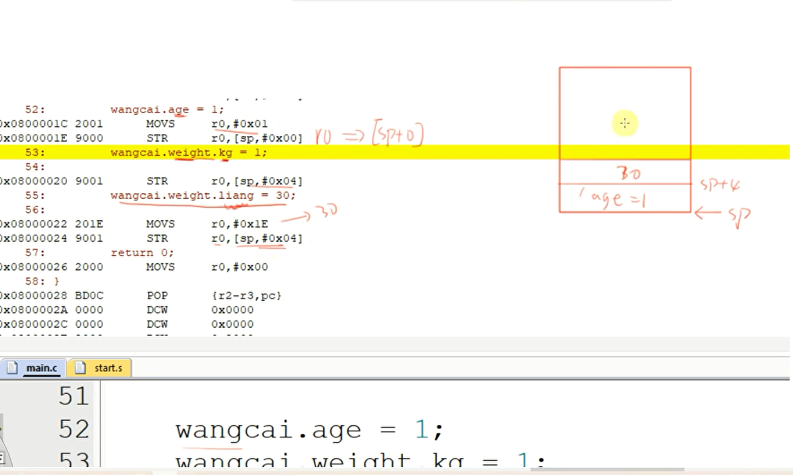


位域

```c++
struct cat {
    int sex:1;//占据一位
    int old:1;//占据一位
    int age;//占据4位
}
struct cat abc;
abc.sex=1;
abc.old=1;
abc.age=1;

```

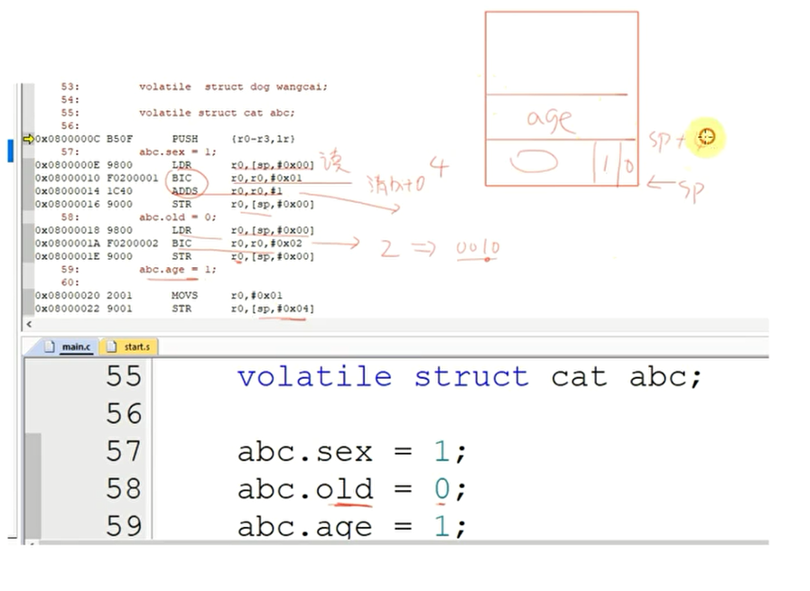

### 头文件的作用

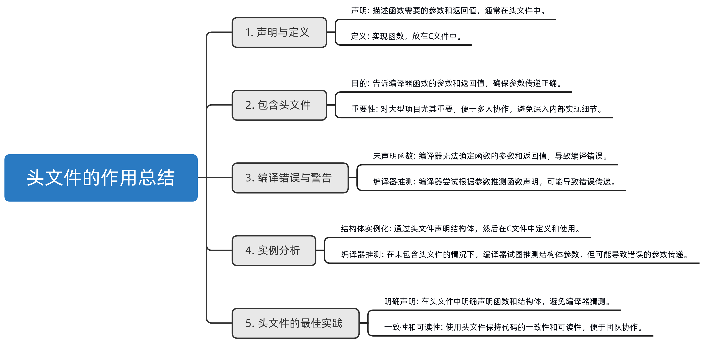

防止多重定义

```C++
#ifndef _DOG_H
#define _DOG_H

#endif
```

### 指针本质

### 使用指针访问硬件

```C++
int *p;
p=(int *)0x40001000
*p=123;
```

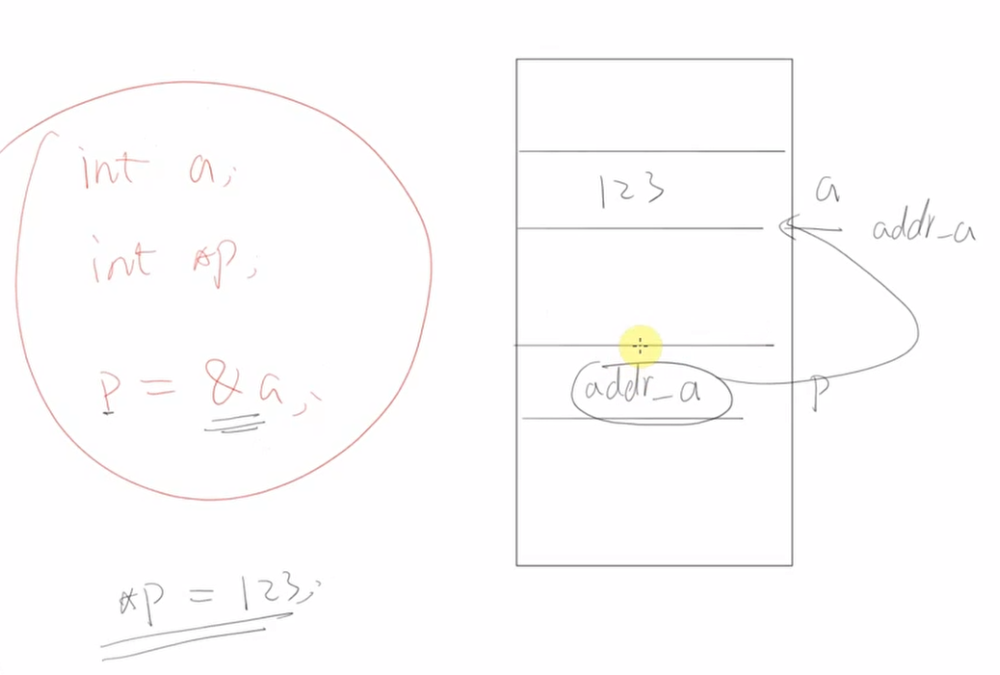
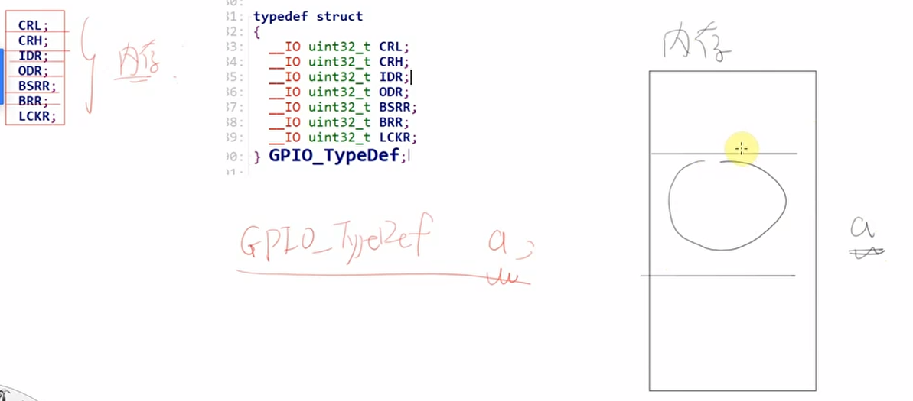
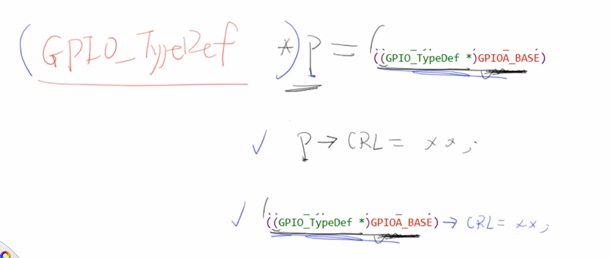

